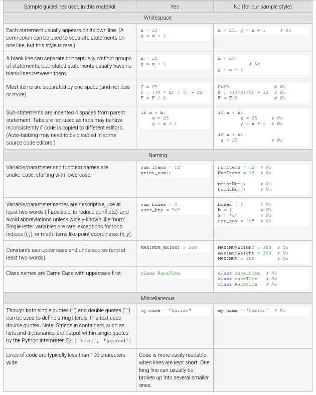

# Coding Practices

-----

## Formatting
- PEP8
    - [Pep 8](https://pep8.org/)
    - [Pep 8 Easy Chart](https://www.educative.io/blog/python-pep8-tutorial)
    - [Intial Pep 8 Post](https://peps.python.org/pep-0008/)
    - [Google's Python Style Guide](https://google.github.io/styleguide/pyguide.html)

# Basic Styling Per The Book

