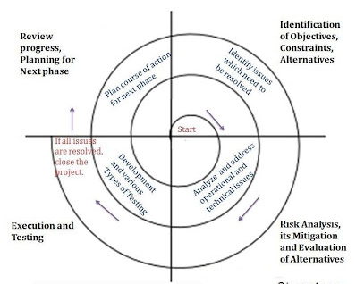
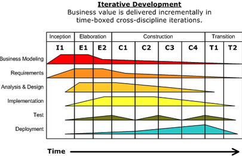

# Module 2 Day 1 Lecture Notes

----

# Software Development Methodology

## History
- There were obviously older software development methodology
- Waterfall
  - Created during the 1970s 
  - Already discussed
- There other processes made:
  - Spiral Model (1986)
  - 
  - Rational Unified Process (RUP) (1999~2003)
  - 
- Agile Manifesto created 2001

## AGILE
- Why Agile instead of Waterfall
  - Waterfall is what's considered a "heavyweight" software development methods
    - Very regulated (change to the project must be very controlled)
    - Planned out (hitting certain benchmarks by specific points)
    - Micromanaged
    - Often used for the sake of creating a product which will be complete at the end
    - End product is defined and fixed
- Agile is Lightweight!
  - Instead of strictly following a process, agile deems it more important for individuals to interact with each other to talk about their project
  - Instead of following strict documentation standards, agile deems it more important to create working code first and foremost
  - Instead of trusting an original contact on a project, agile encourages developers to reach our and collaborate with the customer as to what the product should be
  - Instead of sticking with a plan, agile prefers to respond to change as the need arises
  - These were the sentiments shared by the original creators of agile: https://agilemanifesto.org/
- Used whenever the project is under continuous development
- Based off features to add to project
- These are the general features of any agile development

## SCRUM (An extension of agile)
- See [THIS](https://speakerdeck.com/mikecohn/getting-agile-with-scrum-ndc-2014?slide=6)

## [Other Methodologies](https://deltanem.com/8-software-development-models-organized-in-charts-and-explained/)

----

----

## Loops
- While loop
  - Forever Loops
- For loop
  - How to do what you could do with a for loop in a while loop 
  - 'in' keyword 
  - Range Function
  - Enumerate Function
  - Off by 1 error
- Break, Continue
  - example for break: searching for something
  - example for continue: counting certain items (continuing if that item type was not found)
- Loop Else
- Nested Loops

----

## Time Complexity
  