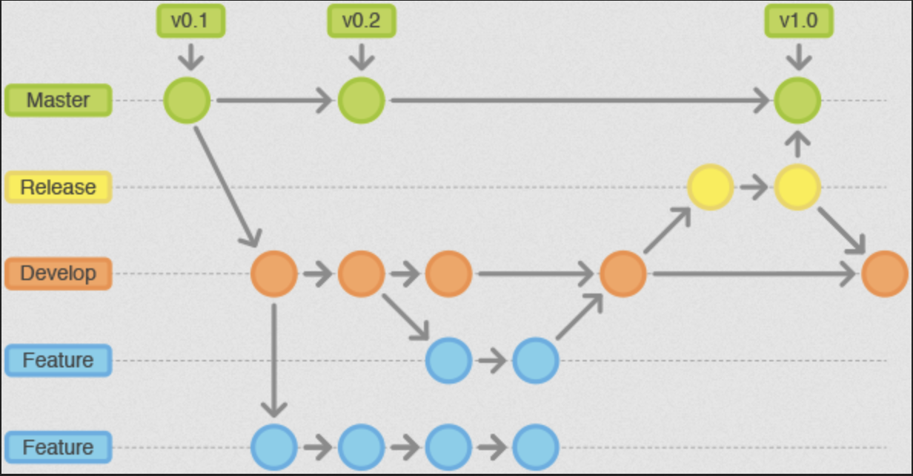
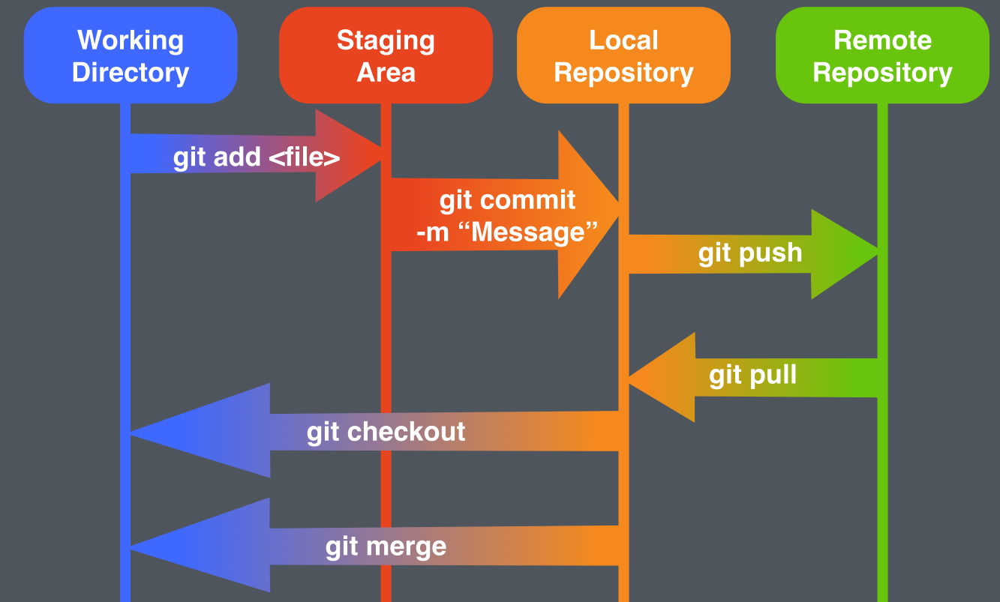

# How Git Works

# Installing git:

If you have a package manager, it should be as easy as running:
```
<package-manager> install git
```
Some package managers use 'add' instead of 'install', but you hopefully know the difference!
Now, if you would like package manager, look at the following package managers per operating systems:

- MacOS:   [Homebrew](https://brew.sh/)
- Windows: [Chocolatey](https://chocolatey.org/install)

### ***Otherwise, you can just install git from their website [HERE](https://git-scm.com/downloads).***

---

## Timeline



---

# Commands




## Git Init

To get started using git on a project, you need to initialize git!
To do so, just use the following command in the project's directory:
```
git init
```

This creates the .git folder in your project with no changes added to it. Without doing anything else, 
it has recorded nothing concerning your project, but, we can change that.

## Add and commit

To actually have files added to a project, you need to add them using the add command (lots of adds). 
Do that like this:
```
git add <specific file you are adding>
```
This file will be added to a staging area. It hasn't yet been added to your
project, and if you want to remove it from the staging area, you can use the reset command:
```
git reset <specfic file you are removing>
```

To add all the files in a project, you can use:
```
git add -A
```

To remove all files in the staging area, you can use the reset command with nothing else:
```
git reset
```


When you have made a meaningful number of changes and added the files you would like, you can make a commit!
Commits are snapshots of a project at given points of time. It essentially ends up being versions of a project, 
although some people may not refer to them as that. 

So, if you made a bug fix or added a new feature to a project, it is very much time to add the changed files and 
make a commit. When you make a commit, you ought to give it a meaningful message describing the changes you made.
Here is the command to make your commit!
```
git commit -m "<A message>"
```

To see the difference that you have made since the latest commit, you can use the following command:
```
git diff
```

To see what files you have committed, staged or are not yet on your computer, you can use the following command:
```
git status
```

## Pushing to main

Once you have made commit(s) and they are ready to be put into your main repo, you just need run this command:
```
git push
```
This will push your local commits to the remote repository you are connected to.
The other members of your team should also be connected to the remote repository
and when you push your changes, they should be able to see them. 

If another member of your team pushes something to the repo, you should also be able
to see it. This remote repo should be where your project is stored and even if your
local machine is lost or destroyed, you should be able to get your entire project
back from the remote repo.

## Updating your project

Now, when someone makes a change to a repo, your local repository is not automatically updated.
To get the changes made in a repo, one command to use is 'fetch':
```
git fetch 
```
This will get the changes that were made and put them on your local device's git history. 
THIS ALONE WILL NOT UPDATE THE CHANGED FILES ON YOUR DEVICE. This will add the record that something was
changed, but you still need to merge the changes to your device.
Doing ```git status``` will now show the changes made that are not part of your local project

To actually merge the changes made, you use the merge command:
```
git merge
```

Now, it may be annoying to do both of these command in one, so, there is a handy dandy 
command which essentially does both of these actions in one, git pull:
```
git pull
```


## Merge Conflicts

What happens when two individuals both change the same file and push it at the same time?
A merge conflict!


## Branches and Pull Requests

Now, when working on larger projects, 
you will PROBABLY be using multiple branches.
Typically, what you will see is a development branch, and a main-production branch.
Most commits will be made to the development branch, and once 
the project has made significant changes that the team is happy with, they
will merge the development branch with the production branch.

Now, to maneuver between branches, you can use the checkout command
```
git checkout <branch-name>
```

To create a new branch, you just use the branch command, and then
move into that branch. This branch will be based off of whatever
the current branch you are in.

```
git branch <new-branch-name>
git checkout <new-branch-name>
```

or you can do this in one command by doing this:

```
git checkout -b <new-branch-name>
```

Once you have made the changes to this branch and want to merge it
with the main branch, you need to go back to the main branch and 
call the merge command. This would look like this:

For the sake of this example, let's pretend we just committed changes
to a branch named 'tab-bug-fix' and our main branch is called 'main-branch'

```
git checkout main-branch
git merge tab-bug-fix
```

If you are trying to merge you branch with a remote repo
that is on GitHub, what you want to do is make a pull request.

Unless you are the maintainer of a repository on Github, you
may not have access to actually merge changes to the repo on
GitHub. So, you make a pull request, which is a request to merge
the changes you have made, and the maintainer of the repo
will review it and decide whether to add your contribution.

If you would like to do this from the command line, 
look at GitHub's [tutorial](https://cli.github.com/manual/gh_pr_create) (This does require
you do install GitHub's command line tools)! 
I would recommend using your built-in IDE functionality, as it is easier!

## Cloning repositories

So finally, how do you get repositories from these remote places!
You clone em down!
This copies the repo from the remote location on to your current device.
Use the following command to to do so:
```
git clone <repo you are trying to get>
```

If you wanted to clone down THIS repository, use the following command:
```
git clone https://github.com/mccoyJosh/ClassInfo.git
```

# Checking out previous Commits

See you current list of commits:
```
git log
```

This should provide you the unique id of all commits... you can use these in conjunction with the checkout command to
see the project at that point in time. Use the command like this:

```
git checkout <commit-id>
```

To return to the most current branch, you could do another checkout to the most current branch or:

```
git checkout -
```

or if your main branch is called **main**, you can do this:

```
git checkout main
```

