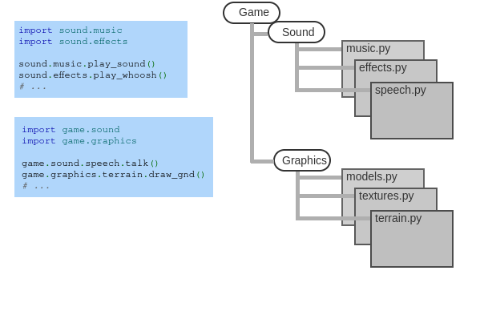

# What are packages

So, up to now, we have discussed MODULES... that
is, another name for files in python and
how it is used to organize our pieces of code to do stuff like
import them.

Sometimes, you need more than a single file for a project
or need to organize a whole set of modules together for a project.

The grouping of these files in a directory is called a **package**




We have discussed previous modules which we can import, but now we are going
to talk about getting access to PACKAGES (from the internet)


# Package managers/installers

Package managers are useful tools for getting 3rd party software
to use for whatever programming problem you are solving.

We briefly talked about this when discussing git, as git can be obtained through
package managers. Here are those package managers discussed previously (for your given operating system):

- MacOS:   [Homebrew](https://brew.sh/)
- Windows: [Chocolatey](https://chocolatey.org/install)

But, today, we are more talking about package installers. Now, this is a coding
language specific type of package installation software program.

Package managers will install software, like git, that is available to use anywhere on your device.
It delivers you system-wide software tools. Package installers will install additional
packages for whatever languages you are using. This is typically additional code
made by someone else in your given langauge which will do some functionality which you would like.


- For Golang, there is a built-in package installer, so you can just run a command and get the packages you need.
- For langauge like Java, there are build systems you can use which work as package installers. For instance,
  gradle will install packages for your java project.

- Now, for python, this is pip.

# PIP

Pip should have been installed whenever python was installed on your device. So, you should have access
to it at the current moment.

Let's say we wanted to use the common library matplotlib
to make some graphs

All you need to do to get the package it run this from within your project:
```
pip install matplotlib
```

Then, import the package you are using and boom bang you can use it.

These packages are hosted on the web, typically by python, and can be found
on pypi.org. Now, there are other sites which host python packages, but
this one is the most common. Here is the page for that package of matplotlib.
Typically, they tell you everything you need to know to get started :)

https://pypi.org/project/matplotlib/

# Example

```python
import matplotlib.pyplot as plt

# Sample data
x = [1, 2, 3, 4, 5]
y = [2, 3, 5, 7, 11]

# Plotting the data
plt.plot(x, y)

# Adding labels and title
plt.xlabel('X-axis')
plt.ylabel('Y-axis')
plt.title('Simple Line Plot')

# Display the plot
plt.show()
```