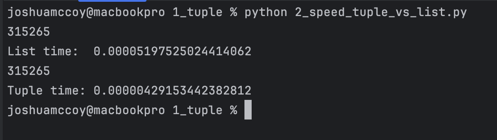

# Data Structures


# Tuple

Another data structure is a tuple
Tuples are very similar to lists, BUT TUPLES ARE IMMUTABLE
So creating one looks like this:


GENERAL FORMAT:
```
<tuple-name> = (<item_1>, <item_2>, ..., <item_n>)
```

Although once a tuple is made, it cannot be changed! (SINCE IT IS IMMUTABLE)
You are going to want a tuple when the data you are using SHOULDN'T be changed
Also, tuples are handled faster than lists are in python, so if you have a list of constants, USE TUPLES


```python
tuple_1 = (1, 2, 3, 4, 5)

# tuple_1[0] = 6 <----- THIS LINE DONT WORK SINCE IT attempts to change the tuple!
# You can access items from a tuple just like you would from a list though:

print(tuple_1[4])
```


YOU CAN convert it to a list though and then change it then change it back if you really want to though

```python
tuple_1 = (1, 2, 3, 4, 5)
list_1 = list(tuple_1)
list_1[0] = 'hello'
print(tuple(list_1))
```


Also, just like lists, tuples can also hold different types of variables

```python
tuple_2 = ("here is a string and there is an int and float ->", 1, 5.23)
```


Lists cannot be used as dictionary keys, but tuples can! (because they are immutable)
This allows us to create keys for dictionaries based off of multiple values:

```python
people = {
    ('1/2/1980', 'Jimmy', 'Johns') : 124525325,
    ('1/2/1980', 'Elliott', 'Johns') : 34346,
    ('1/2/1980', 'Marley', 'Lang'): 545,
    ('1/2/1980', 'Jonah', 'Hudson'): 23,
    ('1/2/1980', 'Erik', 'Selinas'): 77777,
    ('1/2/1980', 'Gabriel', 'Gaines'): 45346,
    ('7/16/1976', 'Kade', 'Garza'): 9898,
    ('7/16/1976', 'Colt', 'McClaine'): 11111,
    ('6/21/2000', 'John', 'Bravo'): 234444,
    ('1/2/1980', 'Alma', 'Clay'): 88888888,
    ('12/6/1999', 'Jonas', 'Cochran'): 126,
}

print(people[('7/16/1976', 'Kade', 'Garza')])
```

## Speed of Tuple vs List

```python
import time

rang = range(31526536)
example_tuple = tuple(rang)
example_list = list(rang)


t_start = time.time()
print(example_list[315265])
t_end = time.time()

print(f"List time:  {(t_end - t_start):.20f}")


t_start = time.time()
print(example_tuple[315265])
t_end = time.time()

print(f"Tuple time: {(t_end - t_start):.20f}")


```

### Results




------------------

# Set


The last and final type of data structure we are going to talk about is a set


Use {} to make a set
KEEP IN  MIND THAT JUST {} IS ACTUALLY AN EMPTY DICTIONARY
Really, a set is a dictionary without the associated values and just has keys (unique, unordered values)

```python
example_set = {'apple', 'banana', 'cherry'}
```

a set needs all values need to be unique

```python
example_set = {'apple', 'banana', 'cherry', 'cherry'}
print(example_set)                                      # The second cherry is not added
```

You can't change items in the set, but you can add and remove from it

```python
example_set = {'apple', 'banana', 'cherry', 'cherry'}
example_set.add('lemon')
example_set.add('avocado')
example_set.remove('apple')
print(example_set)
```

you may have notices that the items in a set are not the same if ran multiple times
That is because a set is unordered

It exists to just hold items and that's about it

You can get every item in the set with a for loop though:

```python
example_set = {'apple', 'banana', 'cherry', 'cherry'}
for element in example_set:
    print(element)
```

## USES
The main use of sets is to remove duplicate values, since sets cannot contain duplicates
Sets in python are very similar to sets in mathematics, so using them
to represent them as such is very helpful

See more info here:
https://python.land/python-data-types/python-set#Why_would_you_need_sets


