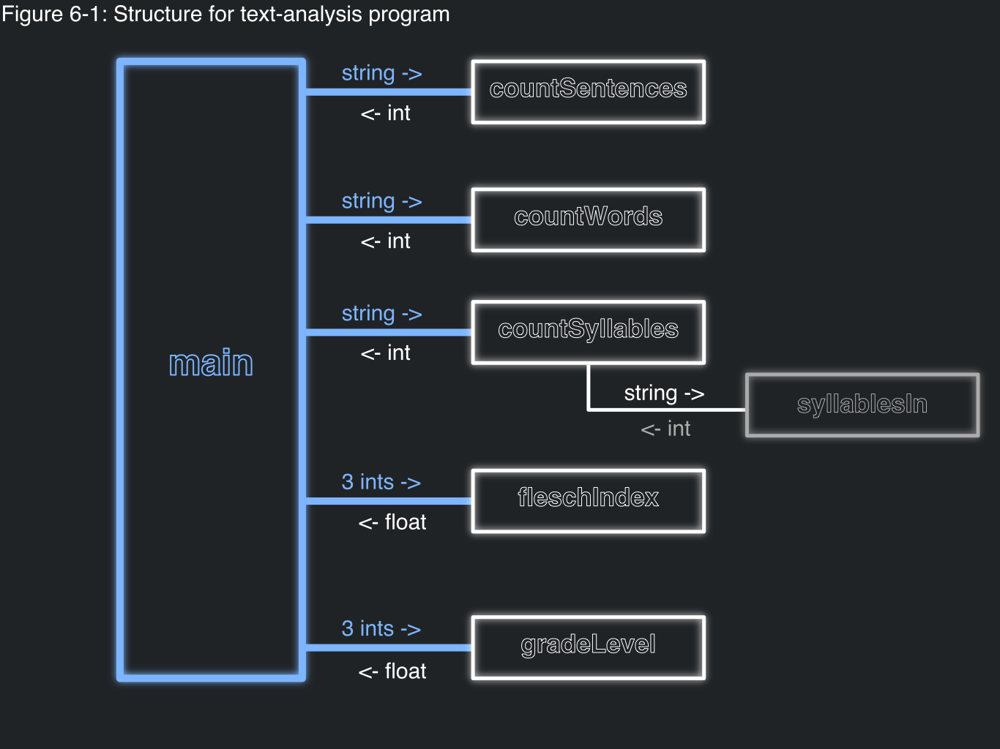
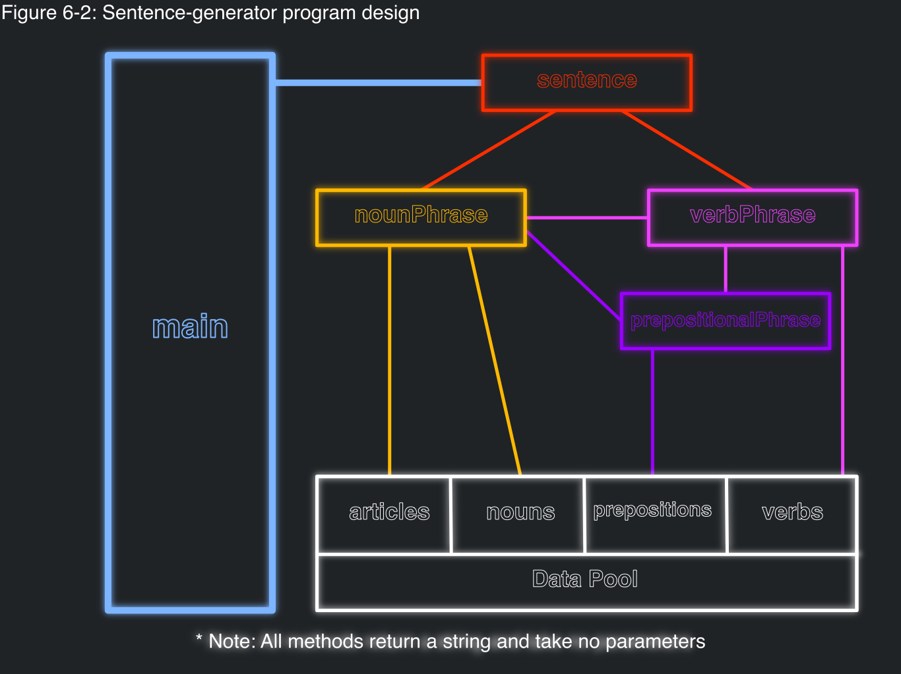

# Top-Down Design

One (of many) strategy to design projects is a top-down design.

The top-down design starts with problem decomposition.

**Problem decomposition** is knowing the entirety of a project, and 
breaking it down into smaller problems.

When decomposing a problem and once it has been made small and manageable, you
can assign it to a function.

This problem may prove to be 3 smaller problems, which can all be given their
own functions.

Eventually, you have the whole project consisting of functions running smaller
and smaller functions which should do whatever action you designed the program around.

This process of continually breaking up your problems into smaller and smaller 
problems is called **_stepwise refinement_**.

----

## Design of Text-Analysis Program

In chapter 4, there was a program discussed called Text Analysis. The goal of the program
is to measure text readability that is determined by the Flesch Index. It is based off 
the average number of syllables per word and the average number of words per sentence in a piece of text.
With these averages, we plug it into Flesch's Formula to get the index:
```
F = 206.835 - 1.015 X (words / sentences) - 84.6 X (syllables / words)
```

There is also the Flesch-Kincaid Grade Formula which we can use to determine what grade level reading we are looking
at:
```
G = 0.39 X (words / sentence) + 11.8 X (syllabes / words) - 15.59
```

If we want to go about this problem from a top-down approach, we need to start breaking down the problem.

We know there is going to be some sort of main method which takes in the input of the file.
This isn't a specific problem we really need to create a method for, but we can if we'd like
(it would just be an additional method called something like 'getText' given a string and returning a string).

But, once we have the text, we know the formulas we need to solve, but we do need to get everything for the formulas.
So, lets break up the formula and see what we need.

- Number of sentence
- Number of words
- Number of syllables

Once we have these values, we can just plug them into their given formulas 
These formulas can also be put inside their own methods, to help reduce the complexity of the main method

- Calculate Flesch's Index
- Calculate Grade level

Now, the only other thing we really need to do is to see if we can break up anymore of these subproblems into even
tinier problems.

The number of sentences is pretty straightforward: counting the number of punctuations.

The number of words can be easily gained from seeing how many words appear from splitting up the text by spaces,
which can be done on one line with len(text.split())

Now, getting the number of syllabuses may prove to be more complicated than just writing a single line.
We are going to need to go through every word and see if it contains a vowel. This is a problem with a subproblem
contained within it -> finding the number of vowels in a single word. 
This should become another method which is called per word in the get syllables method.

If we continue down the line, we just have the two methods which calculate the formula. Both
of these methods can just be one line of doing the calculation given the 3 numbers, so, no subproblems should exist

With all this done, we can begin implementing all the said methods and combine them into the main method.
This also allows us to focus on implementation of smaller problems, which makes a larger project much more manageable.




---

## Design Sentence-Generator Program

Let's take a look at another project. In chapter 5, there was an example of a sentence-generator program.
Typically, whenever we want to make a sentence, if consists of a noun and a verb.
'I jumped'
'The dog ran'
Stuff like this.
This can be expounded upon to include prepositional phrases which should give us more complicated sentences.
These 'rules'  are the grammar of our language.
When making a sentence, the grammar rules you need to spcifically follow are as followed:

1. Sentence = Noun phrase + Verb Phrase
2. Noun Phrase = Article + Noun
3. Verb Phrase = Verb + Noun phrase + Prepositional phrase
4. Prepositional Phrase = Prepositional + Noun Phrase

For this specific problem, the grammar itself guides us as to what our methods should look like.
Obviously, we need a main method, but then the main method should call a method which
creates a sentence.

(... you can see the figure.)




