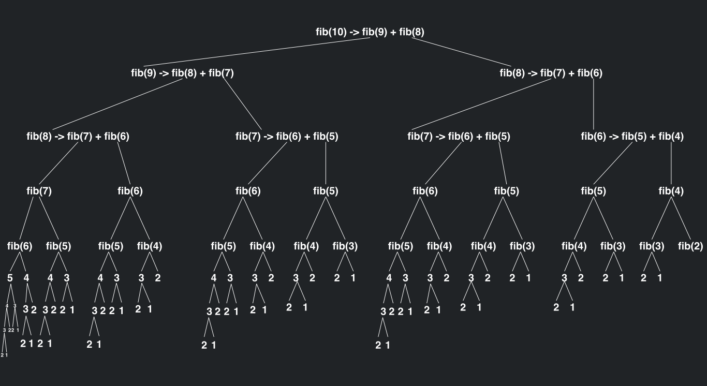

# Recursive functions

Sometimes, when decomposing a problem, 
you may find the subproblem can be solved 
with the method you already have.
SO, why not just call that method from within itself!

This is where **recursive design** and by extension 
**recursive functions** come in handy. 


## Creating Recursive Functions

**_Recursive function_**: A function which calls itself

For example, here is a recursive function:
```python
def rec_function():
    rec_function()
```
This function has a call to itself within itself.
When we are talking about recursive methods, a method executing its code 
is considered **recursive step**.
The actual call to the method you are in is called a **recursive call**.

If we were to run the code above, it would run its one line, which is itself, 
so, it would then run its one line, which is itself,
so, it would then run its one line, which is itself, 
and so on and so forth.
It would continuously run recursive step after recursive step.
This code will never end.

So, whenever you create a recursive function, you need at least one 
type of selection statement (if or otherwise) to stop the code.
The boolean expression contained within the
selection statement that will decide whether to stop 
the code or not is _called_ the **base case**.

----

## Example (Print List Backwards)

Let's try to convert an iterative algorithm 
(what we have done up to this point) that 
just prints out a list backwards to a recursive alrogitrhtm!

Here is what we would do iteratively
```python
ex_list = [1, 5, 7, 2, 9, 2, 4]

def print_list_backwards(l):
    i = len(l) - 1        # this will start out array at the end of the list
    while i >= 0:         # this will make the loop stop when it gets to the start
        print(l[i])
        i = i - 1         # this will make it go backwards

print_list_backwards(ex_list)
```

If we want to convert this to a recursive method, we need to know
what to use as the base case (since we do want the recursive method to end).
In this case, we can look at the while loop for some help as to what we should do!

The while loop goes WHILE i >= 0, meaning it will STOP at i == -1 (or any
value where i < 0). That... is exactly what we need; the value to determine when
to stop. So, we can use it for our base case!

Now, the only problem we have when converting to a recursive functions is that 
we don't have an index variable which will remain constant from one recursive step
to the next. Therefore, we must pass it in as a parameter into the function. 

Let's make the function now!
```python
ex_list = [1, 5, 7, 2, 9, 2, 4]

def rec_back_print(li, index):
    if index < 0:
        return
    print(li[index])
    rec_back_print(li, index - 1)

rec_back_print(ex_list, len(ex_list) - 1)
```

Notice these things:
- We have the parameter 'index' to actually know where we are in the list
- When we do the recursive call in the method, we subtract index by 1. 
**THIS IS CRUCIAL** Although the base case is important and makes the 
recursive call stop, we **NEED** to push the algorithm in some way to actually reach
the base case. In this case, this is a matter of subtracting 1 by the index each time. 
This gets us closer to index actually being less than 0.


As this program shows, you typically need at least one parameter in a
recursive function as to have something to test the base case for. In this
case, we used index to test the base case, but, whatever it may be, it
needs to change as to approach the base case.

----

## Summation Recursively

Let's go over another example: summation.
Here is the code we did earlier:
```python
def summation(lower, upper):
    result = 0
    while lower <= upper:
        result += lower
        lower += 1
    return result
```

This iterative algorithm has a few differences when compared to out last algorithm.

- First off, we are no longer approaching 0, but instead lower needs to be greater 
than upper for the algorithm to stop (lower <= upper becomes false when that is the case).
- Secondly, we are not going to subtract by 1; this would actually bring us
farther away from the base case! Instead, we want to increment lower by 1 every recursive step.
- Finally, the summation method needs to return a value unlike the reverse print method, since 
we just needed to print in that case. **Because of this, we need to make sure we return the correct value
at the base case and at every recursive call**.

So, let's make this a recursive method!

```python
def summation(lower, upper):
    if lower > upper:
        return 0
    return lower + summation(lower + 1, upper)
```

You may notice that the result method is completely gone and has essentially
been replaced by the values being returned. This is an essential feature of a recursive function.
Instead of having an explicit variable which holds the returning value, all
the returns from all the recursive steps should accumulate the correct answer, which
we see being done here.

To more clearly see this in action though, lets walk through the recursive steps!

----

# Trace Recursive Function

Walking through the code can also be referred to as **tracing** the code.

Let's say for instance we call the summation method this way:
```
summation(5, 10)
```

Calling summation(5, 10) will fail the if statement and therefore get to the line 
return lower + summation(lower + 1, upper), so, lets fill in those values with our current lower and upper values:

return 5 + summation(5 + 1, 10)

and simplify

return 5 + summation(6, 10)

so, then we walk through the summation again.
For the sake of simplicity, lets map this out on a table:

| Initial Recursive Step                         |                                                |                                                |                                                |                                                 |                                                   | Final Recursive Step with all other recursive steps still 'alive' | Walking back down to the initial recursive call | Final return |
|------------------------------------------------|------------------------------------------------|------------------------------------------------|------------------------------------------------|-------------------------------------------------|---------------------------------------------------|-------------------------------------------------------------------|-------------------------------------------------|--------------|
|                                                |                                                |                                                |                                                |                                                 |                                                   | summation(11, 10) = return 0 (REACHES THE BASE CASE)              | summation(11, 10) = return 0 = 0                |              |
|                                                |                                                |                                                |                                                |                                                 | summation(10, 10) = return 10 + summation(11, 10) | summation(10, 10) = return 10 + summation(11, 10)                 | summation(10, 10) = return 10 + 0 = 10          |              |
|                                                |                                                |                                                |                                                | summation(9, 10) = return 9 + summation(10, 10) | summation(9, 10) = return 9 + summation(10, 10)   | summation(9, 10) = return 9 + summation(10, 10)                   | summation(9, 10) = return 9 + 10 = 19           |              |
|                                                |                                                |                                                | summation(8, 10) = return 8 + summation(9, 10) | summation(8, 10) = return 8 + summation(9, 10)  | summation(8, 10) = return 8 + summation(9, 10)    | summation(8, 10) = return 8 + summation(9, 10)                    | summation(8, 10) = return 8 + 19 = 27           |              |
|                                                |                                                | summation(7, 10) = return 7 + summation(8, 10) | summation(7, 10) = return 7 + summation(8, 10) | summation(7, 10) = return 7 + summation(8, 10)  | summation(7, 10) = return 7 + summation(8, 10)    | summation(7, 10) = return 7 + summation(8, 10)                    | summation(7, 10) = return 7 + 27 = 34           |              |
|                                                | summation(6, 10) = return 6 + summation(7, 10) | summation(6, 10) = return 6 + summation(7, 10) | summation(6, 10) = return 6 + summation(7, 10) | summation(6, 10) = return 6 + summation(7, 10)  | summation(6, 10) = return 6 + summation(7, 10)    | summation(6, 10) = return 6 + summation(7, 10)                    | summation(6, 10) = return 6 + 34  = 40          |              |
| summation(5, 10) = return 5 + summation(6, 10) | summation(5, 10) = return 5 + summation(6, 10) | summation(5, 10) = return 5 + summation(6, 10) | summation(5, 10) = return 5 + summation(6, 10) | summation(5, 10) = return 5 + summation(6, 10)  | summation(5, 10) = return 5 + summation(6, 10)    | summation(5, 10) = return 5 + summation(6, 10)                    | summation(5, 10) = return 5 + 40 = 45           | returns 45   |

Every column shows all recursive calls that are currently in action. This is the **call stack**.
Each row shows a **stack frame** coming into existence and eventually being solved.

All of these recursive step have to wait for the recursive call they made
to actually finish their method. Every recursive step is placed on a stack
while it waits for the recursive step it called to finish. In the column labeled "Final Recursive Step with all other recursive steps still 'alive'", 
we can see all the methods on the stack when the base case is actually reached. Typically, this is the point when the most recursive steps
are on the stack.

Regardless, what we see is that the final summation will actually start adding up from the last recursive call, and
get summed down back to the initial recursive call. So, it starts with the base case value of 0, then adds 10 to that
and 10 is returned to where it was called, and 9 is added, and 19 is returned to where it was called, and so on and so forth
UNTIL it gets back to down the initial call where the total value is returned.

---

# Stack overflow error (Infinite Recursion)

Now, we have already discussed that recursive methods can easily be made to run forever, but now with the understanding
that python will push methods on to a stack while it finishes another method, we can actually talk about what will happen if you 
make an infinite recursive call. Eventually, your computer will run out of allocated memory to store the number of 
recursive calls. 

Allocated memory is the amount of space your computer gives your python program to run. This may be a few megabytes,
to a few gigabytes. 

Regardless, you can easily fill it up with recursive calls, as each step is thrown on the stack.
What this results in is a **stack overflow error**. Now, if you have ever looked up coding help
you have probably seen the stack overflow website, which is named after this error.

But, if you are encountering this error in your code while creating a recursive method,
it means you have incorrectly made a recursive method. Maybe your base case is wrong, maybe you
have not made it so that the base case can be reached, but whatever it is, it needs to be fixed!

The initial recursive method I showed in this section will result in this error:

Here is that code again:
```python
def rec_function():
    rec_function()
    
rec_function()
```

Here is that error:
```
Traceback (most recent call last):
  File "/SDEV140/M05/Day1/example.py", line 4, in <module>
    rec_function()
  File "/SDEV140/M05/Day1/example.py", line 2, in rec_function
    rec_function()
  File "/SDEV140/M05/Day1/example.py", line 2, in rec_function
    rec_function()
  File "/SDEV140/M05/Day1/example.py", line 2, in rec_function
    rec_function()
  [Previous line repeated 996 more times]
RecursionError: maximum recursion depth exceeded
```

It doesn't say stack overflow error explicitly, but that is what it essentially is. 
Really, this doesn't mean it got to the limit of the stack, but python will set a conservative
value for the number of stacks possible for code to prevent an actual stack overflow error (in this case, ~1000).
You can increase this value IF NEED BE, but it may cause an actual stack overflow error.

----

# Recursively going through file system

One problem that is solved eloquently with recursive methods is going through a file system.
Let's say you needed to know all the files and folders in a given 
directory. What you need to do is go to every directory, 
print out the files and folders there, and go inside all the 
directories within said directory and print out all the files and folders
there as well. Since you doing the same thing every directory, this seems like an action 
possible by a recursive method.

```python
import os

def print_files_in_directory(directory):
    for filename in os.listdir(directory):
        file_path = os.path.join(directory, filename)
        if os.path.isdir(file_path):
            print("Folder:", filename)
            print_files_in_directory(file_path)
        else:
            print("File:  ", filename)

print_files_in_directory("../")
```

Notice that there is no base case for this recursive function. It
ends when it runs out of files/folders to go through.

If we tried to do this same problem without a recursive method, it would
be difficult to track what folders we may have already encountered.

For instance, if we encountered two folders in the same directory,
we can't simply begin reassigning all of our variables and start going into
one of the directories, because we would lose access to the directory we didn't go into
at this point. If you did do this, you would need to utilize some list or stack of your
own to store the directories which you may have skipped over to ensure you had
gone through all of them.


----

# Recursive Definitions

Recursive functions are very well suited for problems which are defined as **recursive definitions**!
A recursive definition consists of equations that state what a value is for one or more base cases and one or more
recursive cases.

One such instance of this type of equation is the fibonacci sequence. 

The Fibonacci sequence takes the two previous numbers in a sequence and adds them together, and it
has an initial 2 values of 1 and 1. So, 1+1 = 2, 1+2 = 3, 2+3 = 5 and so on. You end up getting a sequence like this:

1 1 2 3 5 8 13

This sequence of numbers can be defined with the following equations:

(this gives us the value for the **nth** value of the sequence)

Fib(n) = 1, when n = 1, or n = 2
Fib(n) = Fib(n - 1) + Fib(n - 2), for all n > 2

You may notice that the equation uses itself for its definition. If we try to solve Fib(4) 
(solving for the 4th value in the Fibonacci sequence), it would look like this:

Fib(4) =  Fib(3) + Fib(2)

We don't know Fib(3), so let's solve that:

Fib(3) =  Fib(2) + Fib(1)


We already know Fib(2) and Fib(1) from our base cases:

Fib(1) = 1 and Fib(2) = 1

so lets plug them in

Fib(3) =  1 + 1 = 2

and now we can solve for Fib(4)

Fib(4) =  Fib(3) + Fib(2)

Fib(4) = 2 + 1 = 3

The 3rd value in the sequence is in fact 3!

Now, this looks a lot like what we were doing for recursive methods... walking all the way back to the base
case of our problem and working up to the final solution. Also, the equation uses itself in its definition, which
is what recursive methods do. This is an excellent problem to use to solve using a recursive method:

```python
def fib(n):
    if n < 3:
        return 1
    else:
        return fib(n - 1) + fib(n - 2)

print(fib(4))
```

This code is nice and dandy and does work and looks great!
But, if you attempt to do something like:

```
fib(80)
```

You may have problem: it takes forever!

Now what is happening here.

Essentially, every time this method is called, it calls itself twice, right.
If we wanted to find n = 1 or n = 2, it would be no problem, but, if we tried
finding n = 3, it would call fib twice for fib(1) and fib(2).

If we wanted to find n = 4, it would call for fib(3) and fib(2), and fib(3) would call both fib(1) and fib(2)
This is alright for now, but the more numbers we add, we will call exponentially more methods.

Here is a tree of all the methods being called if we just do fib(10)



What we end up seeing is that the SAME methods end up being called over and over again. Problems
the computer has already solved, yet it doesn't know that.
Fib(80) takes forever because there be around 2^78 methods trying to be completed.

2^78 is 302,231,454,903,657,293,676,544

This helps show that, despite being a seemingly elegant solution, it may not be the most efficient.
The fibonacci sequence can be done this way, iteratively:

```python
def fibonacci(n):
    fib_sequence = [1, 1]

    if n < 3:
        return fib_sequence

    while len(fib_sequence) < n:
        next_fib = fib_sequence[-1] + fib_sequence[-2]
        fib_sequence.append(next_fib)

    return fib_sequence


n = 40
fib_sequence = fibonacci(n)
print(fib_sequence[n - 1])
```

This is done efficiently by just storing the values of the sequence and referencing those for finding
the next value. Now, we can also just apply this same idea (saving the numbers) to our recursive problem
and we no longer have the problem we previously did:

```python
def fib(n, save={}):
    if n in save:
        return save[n]
    elif n < 3:
        return 1
    else:
        save[n] = fib(n - 1, save) + fib(n - 2, save)
        return save[n]


print(fib(80))
```


----

# Costs and benefits of recursion

This exercise has helped show the costs vs benefits of using recursion.

Pro
- Natural and elegant solutions

Con
- Overhead cost on the computer to do the recursive calls


