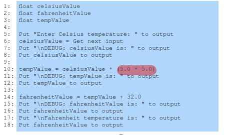

# Debugging

## What is debugging

Whenever we write code, it is (hopefully) designed to solve a problem.
It really wouldn't be much or a program otherwise.

Now, sometimes, you write the code and it does not solve the problem.

Maybe it isn't running, maybe it is miscalculating something; it does not run.

This *thing* that is making the program not run is a **bug**. 

Now, if you knew what was making the thing not work, then erm you really wouldn't even 
need to worry about anything or even really giving it a name and process of finding it AND
you would just fix it.

But this is the problem: you often don't know why or how to fix it.

This is where **debugging** comes into play, as it is the process of finding bugs and fixing them.

## Basic Debugging

### Visual Inspection

The most basic sort of way to go about finding a bug it by visual inspection.

> **visual inspection**: looking at each statement one-by-one to try and find the bug. 

The *proper* way to do this is by first process each line with the hypothesis *this statement ahs a bug* and
trying to disprove it. If it is disproven, move on; otherwise, fix the bug.

### Debug Output Statements

Now, visual inspection is perfectly fine, but often time-consuming, especially if you have many lines
of code.

Typically, you should narrow down to what area you need to visually inspect to save yourself LOTS of time.

What you can do is use a debug output statement:

> **Debug Output Statement**: Inserting prints/outputs *around* where a bug exists to hopefully have an output
> show something to print out incorrectly/not at all to narrow down when the bug begins!



The output from this code would look like:
```
Ebter Celcius temperature: 100.0
DEBUG: celciusValue is: 100.0
DEBUG: tempValue is: 4500.0
```

This help show us a few features from this debugging method:
- printing out inputs to make sure they were received correctly
- printing out variables as they are calculated so if an error exists in a specific step, we can see it
- printing out the name of the variables being tested
- making the DEBUG statement visually different from other outputs to differentiate them.

### Hierarchical Debugging

In the previous example, there is a DEBUG output on nearly every other line.

For smaller programs like this, this is okay!

BUT, if you do have a LARGE program, you probably shouldn't do this.

Instead, break up your large program into smaller regions and print
out a debug line after each section to check if the bug exists in the code yet.

Once you actually found the region the bug exists, then you can begin the line-by-line method of finding bugs.


-------
 

# Examples


## Calculation Error


## Logic Error


## Loop Error


## Function Error


## Programming Knowledge

Sometimes, the problem is that you simply don't understand what you are working
with, which is okay! The whole point of all of this and the class is to learn.

Hopefully, but debugging, you discover new things about a programming language or tools
which you did not know before!
