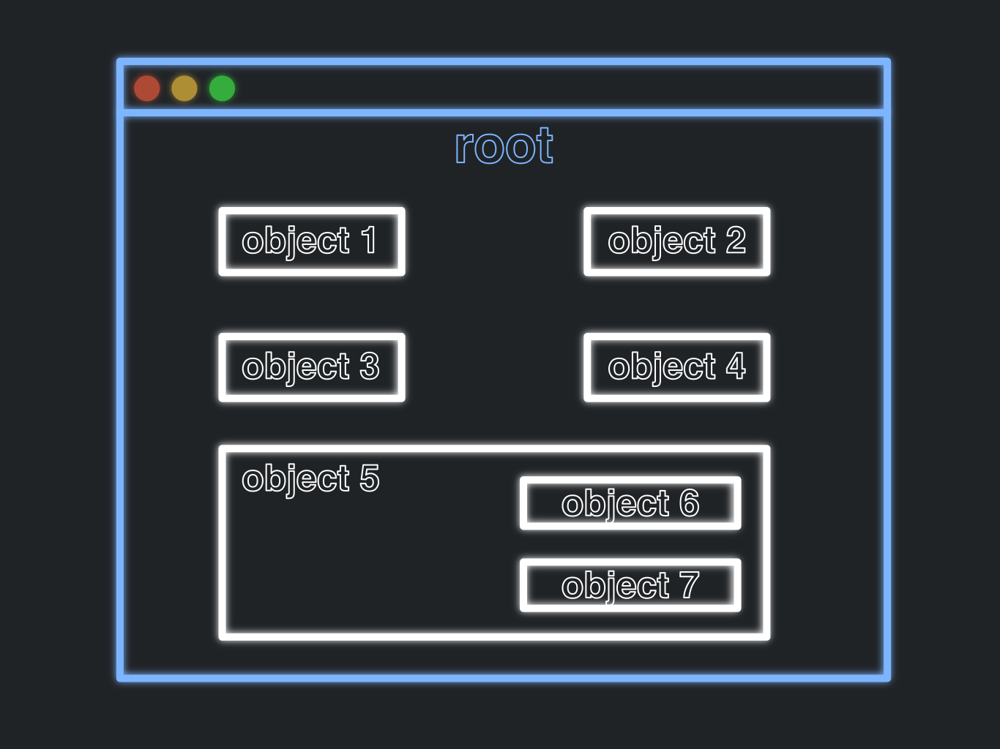

# What is a GUI?

GUI stands for Graphical User Interface. GUIs are programs which can be operated by and/or displayed using
graphics. That is to say, it is a program where you operate it via buttons and displays... which is 
most programs you use. Think of chrome, any of the IDEs you've messed with, any game you have played...
really anything that isn't run straight from the terminal probably has some GUI.


---

# Event Driven Programming
So, up to this point, we have only made terminal based programs. In these terminal based programs,
we would sometimes prompt the user to enter an input, and do whatever. Us as developers had complete control
of when the user could do anything. 
```python
print('Hey look I am deciding that this should come first')
value = int(input("Please enter a number: "))
print('I know by this point in the code that value should have been inputted can I can do what i want here!')
```
For GUI's, it is a bit different.

When designing GUI's, the user of the program has a lot more control, as they can have multiple buttons and options
displayed to them, and they may choose any which one of them. Our job as developers is to make a program to respond
to these events occurring, whether that be a button pressed, a submission field being type, or whatever it is.

### THIS IS THE IDEA BEHIND EVENT DRIVEN PROGRAMMING 

After setting up the GUI we want, we essentially set up the code to do certain actions if the user initiates specific
event. The program is driven by the events being done by the user. We will see this in this next example:

---

# Example

Let's make a program to add two numbers together:

## Terminal Version
```python

def getIntegerInput(msg : str):
    while True:
        try:
            inp = int(input(msg))
            return inp
        except (ValueError):
            print('Please type in a number')

def add_nums(n1, n2):
    return n1 + n2
            
def main():
    print('We are going to add two numbers!')
    num1 = getIntegerInput('Please enter the first number: ')
    num2 = getIntegerInput('Please enter the second number: ')
    print(f'Result: {add_nums(num1, num2)}')


if __name__ == '__main__':
    main()
```

- The user is forced to give the two numbers and it will be evaluated

- No way to go back and do operation again

## GUI Version
```python
import tkinter as tk

def add_numbers():
    try:
        num1 = float(entry1.get())
        num2 = float(entry2.get())
        result = num1 + num2
        result_label.config(text="Result: " + str(result))
    except ValueError:
        result_label.config(text="Invalid input!")


def main():
    global result_label, entry1, entry2

    root = tk.Tk()
    root.title("Addition")
    
    title = tk.Label(root, text="Add Two Numbers!")
    title.pack(pady=5)
    
    entry1 = tk.Entry(root)
    entry1.pack(pady=5)

    entry2 = tk.Entry(root)
    entry2.pack(pady=5)

    submit_button = tk.Button(root, text="Submit", command=add_numbers)
    submit_button.pack(pady=5)

    result_label = tk.Label(root, text="Result: ")
    result_label.pack(pady=5)

    root.mainloop()


if __name__ == '__main__':
    main()
```

There are many things we need to notice about a GUI:

- ### **Window**
  Everything is contained within the display called a window
- ### **Widgets**
  The components found within the window are consider 'widgets'
  - This includes everything from words, buttons, to entry fields
- ### **Title Bar**
  The title bar is the name of the window which your program appears in. Typically, this will be the name of your project.
- ### **Labels**
  Label are displays which can be used to show any sort of text. This can include numbers or anything else that can be a string.
- ### **Entry Fields**
  Entry fields are area for the user to input data (as a string). In this case, it is used to get the 2 numbers from the user to add them together
- ### **Button**
  The button is... well a button. It can be pressed by the user to perform some action (typically they are tied to a method which will be run). The button we have here we have here will add the two numbers together and show their result.
- ### **Customizable Size**
  This window can be changed in size! You can make it so that the user can't change the size of the window, but, this one allows it.


This example helps shows the difference we are now dealing with.
The user now has a lot more choices as to what they can go about doing.
They can choose which number to input first, or they could choose to press submit without a number being inputted whatsoever.
These are now new problems that need to be accounted for, and which help show EVENT-DRIVEN-PROGRAMMING


# Event-Driven Programming Conclusionish

So, essentially, instead of having your program walk the user through exactly what they should do,
an event driven program gives the users all the tools at their fingertips and the code is expected to respond in the correct
manner.

The first step in making an event driven gui program is the analysis phase, that is, planning! This part is to 
determine what your window should look like and what objects it should be made up of, and determining if you need to 
make objects yourself. For instance, maybe in a number of places you need a label followed by a entry field. Instead
of the same smaller components multiple times, just pack it into a single object and use it however you may need from that
point forward.

----

# Objects And Classes

Before we can really get into coding any GUIs we need to understand just the basics of Object-Oriented Programming.
Object-Oriented Programming (OOP) is the idea of designing software solutions around the use of objects, objects which contain
data and code to do some action on said data. These objects allow for the reuse of different pieces of code but for different data.
They also allow for more direct translations of code to real world problems.

Often in programming languages, an object is referred to as a 'class', which I am sure you have seen before
For example, we've been using lists quite a bit. When we instantiate/create a list, we are making a 'list' object.
```python
l = list()

print(l)


print(type(l))
```

We can see with the use of the type() method as to what type of object we are deal with. This helps us see how 
the type of object is essentially its data type. Also, we can see how objects use codes -> methods.
We have used methods before, but the methods I am talking about are specifically for the data contained within 
the objects. Now, WE HAVE SEEN THESE TYPES OF METHODS BEFORE!

Look at this example:
```python
l = list()
l.append(-19214)
l.append(60)
l.append(10)
l.append(20)
l.sort(reverse=True)
print(l)
```

These were referred to as mutator methods before, but to be more clear, these methods are class methods created for
the list class. They affect the data contained within the list object. That is what they mutate.

Now, the reason we are going over this is that the elements that make up GUIs are objects inherit. To build
a GUI, we are going to use multiple objects that build on each other.

----

# Coding Simple GUI

To start, here we are making a simple GUI which just displays hello world. For this program and the 
rest of the GUI we are making for this class, we will be using tkinter, which need to be imported whenever you use it!

```python
import tkinter as tk

root = tk.Tk()
label = tk.Label(root, text="Hello World!")
label.pack()
root.mainloop()
```

There are a few things we can notice from this example:

- ```import tkinter as tk``` This line gets us access to the tkinter library to use its functionality. 
  The purpose of the 'as tk' at the end of the line tells python to let us use just 'tk' to reference 
  tkinter in the code. This saves us time as we can just use 'tk' instead of 'tkinter' when we want to use the import
- ```root = tk.Tk()``` This line creates for us a new main window object. The way tkinter works is by placing GUI 
  elements on top of other tkinter elements, and the very top level of these elements is this object here, the root!
  See the picture below! It shows how all the other objects are 'placed' on top of the root object, and some inner objects
  can even be placed within (or 'on top of') other objects. You end up with a hierarchy of objects starting from the root.
  **_Regardless of the GUI program you are making, you are going to need some sort of root object._**



- ```label = tk.Label(root, text="Hello World!")``` This line creates a label object, found within 'tk'. A label object, as discussed before, is a object
  which can hold and display text. In this case, we are specifying the text we want is 'Hello World' by specifying that as the 'text'
  parameter. Now, we are also providing 'root' as a parameter. This is us telling the label object where it is going to be placed.
  Now technically, the Label object isn't displayed there quite yet, but it is now a child of the root object.
- ```label.pack()``` This line actually has the label object display on the root object. Up to this point, there would
  have been nothing displayed on the root object. It 'packs' it on to the root object wherever it can find room.
- ```root.mainloop()``` This line finally actually starts the GUI. The root, again, is the highest level in the hierarchy
  of objects making up our GUI, so starting it will start the GUI in its entirety.

---

# Proper Format Of GUI Program

Chapter 8 in the textbook explains this format for how your GUI project should be set up, and frankly, it is a wise 
decision to follow their format. 

### Generalized Format:
```python
import tkinter as tk


class ApplicationName(tk.Tk):
    def __init__(self):
        super().__init__()
        # Initializing the object
    
    # Definitions of event handling methods

def main():
    ApplicationName().mainloop()


if __name__ == "__main__":
    main()
```

A few things are happening here:
- ```import tkinter as tk``` Here, we are again importing tkinter as tk to use it throughout the code:
- ```class ApplicationName(tk.Tk):``` Here, we are creating a class. Up to this point, we have only created methods and variables,
  but, now, we are creating actual object types. In this case, this object's name is "ApplicationName"
  - ### General Class
    Typically, we see classes made like this:
    ```python
    class ClassName:
      data = 2
      def class_method(self):
          print(self.data)
    ```
    notice, there is not () following this simple class... this is because this class is not extending another class.
  - ### Extending
    Now, we are not going to get super deep into this concept now, but when we see () following the class name, it means it
    is extending another class. All the means is that python will use all the methods and data from that class for this class. It means this class is a **_subclass_** of tk.Tk now.
    So, here, out ApplicationName object is extending the tk.Tk object, which means our object will act as a tk.Tk object, that being, the root!
    So, anytime we now reference self, it is going to represent the main root window.
- ```
      def __init__(self):
        super().__init__()
        # Initializing the object
  ```
  This method, __init__ is the constructor method for any object in python. All that means is that whenever this object type is created in the future,
  the constructor will be the first thing ran, and typically, it should 'construct', or set up, the object. Again, this isn't super important to 
  fully grasp right now... all you need to know is that you need this method and we will talk about this more later.
- ```
  def main():
    ApplicationName().mainloop()


  if __name__ == "__main__":
      main()
  ```
  The rest of the code is stuff we have seen before. That is, a main method being created, and then being run only if its modules name is main. 
  The only thing special is ```ApplicationName().mainloop()```. This line is doing exactly what ```root.mainloop()``` was doing before: starting the program. Again, since
  ApplicationName extended tk.Tk, it acts the same as that object, which, the root was that object, so, here the ApplicationName object also can call the mainloop function.


If we were to apply this format to the Hello World program we just saw earlier, it would look like this.

```python
import tkinter as tk


class HelloWorld(tk.Tk):
    def __init__(self):
        super().__init__()
        label = tk.Label(self, text="Hello World!")
        label.pack()


def main():
    HelloWorld().mainloop()


if __name__ == "__main__":
    main()
```

Notice that we did not use the line ```root = tk.Tk()``` or the line ```root.mainloop()```
This is because our HelloWorld object takes the place of root, so the ``` super().__init__()``` line in the __init__ 
method of HelloWorld class essentially takes the place of the ```root = tk.Tk()``` line, while ```HelloWorld().mainloop()```
takes the place of the ```root.mainloop()```.

# Defining Functions for Classes

In our example above, the class HelloWorld has a singular method called __init__ which takes one parameter, being self.
This is going to be the case for any method found within a class. This, though, does not mean you need to provide self
when calling the method. This can be seen in the example below. The print_name() call is not providing any parameters. 
The purpose of the 'self' is to give the class method access to the class's data, in this case, 'name'.
```python
class ExampleClass:
  name = 'josh'
  
  def print_name(self):
    print(self.name)


x = ExampleClass()
x.print_name()
```
