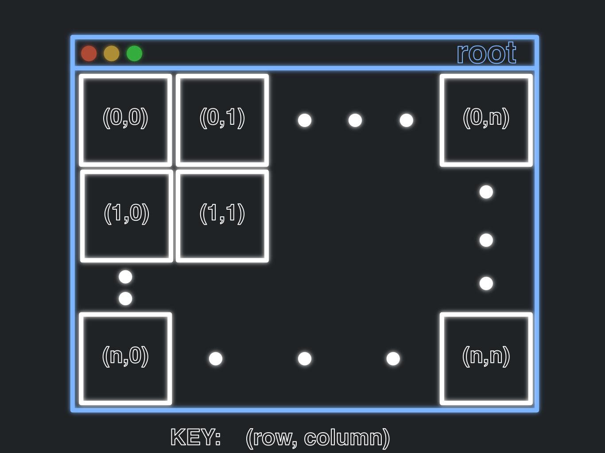

# Windows

----

## Attributes

A window, like as we've seen used in the previous example, is how we view a GUI.
They have many attributes which you are able to access (these are some important ones):

- **title**, this is the title of the window, which is set to an empty string by default
- **width and height** (_geometry_), this is the dimensions of a window, by pixel. By default, this will just fit what data it needs to display
- **resizability**, this determines whether you can resize the window or not 
- **background color**, this determines the background color of the window being created. It is white by default. On Mac, it will use dark gray by default if you have your device switched to dark mode.

In this piece of code, we manipulate all of these attributes of the window:

```python
import tkinter as tk


class HelloWorld(tk.Tk):
    def __init__(self):
        super().__init__()
        label = tk.Label(self, text="Hello World!")
        label.pack()
        self.geometry("300x500")                    # Adjusts the height and width
        self.title("HELLO WORLD PROGRAM")           # Adjusts title
        self.resizable(width=False, height=True)    # Adjusts whether window is resizable or not
        self.configure(background="blue")           # Changes the background color to blue


def main():
    HelloWorld().mainloop()


if __name__ == "__main__":
    main()
```

Changing each one of these is as simple as accessing the correct method/data from `self`
and assigning the value you want!

----

## Layout


### GRID

When you add labels to your window, they are placed in a certain manner. 
Think of the window as a two-dimensional grid, and the items that are placed on it are like points on the grid.
To help see this in action, lets add a few more labels to out existing example

```python
import tkinter as tk


class HelloWorld(tk.Tk):

    def init_window(self):
        self.geometry("300x500")
        self.title("HELLO WORLD PROGRAM")
        self.resizable(width=False, height=True)
        self.configure(background="blue")

    def __init__(self):
        super().__init__()
        self.init_window()

        l1 = tk.Label(self, text="1")
        l1.grid(row=0, column=0)

        l2 = tk.Label(self, text="2")
        l2.grid(row=0, column=1)

        l3 = tk.Label(self, text="3")
        l3.grid(row=1, column=0)

        l4 = tk.Label(self, text="4")
        l4.grid(row=1, column=1)

        l5 = tk.Label(self, text="Way out")
        l5.grid(row=19, column=19)


def main():
    HelloWorld().mainloop()


if __name__ == "__main__":
    main()

```

What we see in this example is that we have created 5 labels, all given indices on a graph, that being the row and column number.
Now, the way the graph works is by starting in the top left and corner with (0, 0) and working out from there. See picture for reference:



Notice how that despite not doing l1.pack(), the objects labels still appear on the GUI. This is because the .grid() method takes the place
of the .pack() method. 


### FONT and ALIGNMENT


Up to this point the grid looks fine because everything is the same size.
But, what if we change the size, and maybe the font aswell.
To set the font, use the 'font' parameter.

```python
import tkinter as tk


class HelloWorld(tk.Tk):

    def init_window(self):
        self.geometry("300x500")
        self.title("HELLO WORLD PROGRAM")
        self.resizable(width=True, height=True)
        self.configure(background="blue")

    def __init__(self):
        super().__init__()
        self.init_window()

        tk.Label(self, text="1", font=("Helvetica", 100)).grid(row=0, column=0)
        tk.Label(self, text="2", font=("Helvetica", 20)).grid(row=0, column=1)
        tk.Label(self, text="3", font=("Helvetica", 50)).grid(row=1, column=0)
        tk.Label(self, text="4", font=("Helvetica", 150)).grid(row=1, column=1)


def main():
    HelloWorld().mainloop()


if __name__ == "__main__":
    main()
```


If we look at this piece of code, the grid looks quite odd. Everything is _kinda_ centered, but the
lack of gray around the labels makes it looks bad. To fix this and actually align the labels correctly, we can use the 
sticky key word parameter and the string "NSEW":


```python
import tkinter as tk


class HelloWorld(tk.Tk):

    def init_window(self):
        self.geometry("300x500")
        self.title("HELLO WORLD PROGRAM")
        self.resizable(width=True, height=True)
        self.configure(background="blue")

    def __init__(self):
        super().__init__()
        self.init_window()

        tk.Label(self, text="1", font=("Helvetica", 100)).grid(row=0, column=0, sticky="NSEW")
        tk.Label(self, text="2", font=("Helvetica", 20)).grid(row=0, column=1, sticky="NSEW")
        tk.Label(self, text="3", font=("Helvetica", 50)).grid(row=1, column=0, sticky="NSEW")
        tk.Label(self, text="4", font=("Helvetica", 150)).grid(row=1, column=1, sticky="NSEW")


def main():
    HelloWorld().mainloop()


if __name__ == "__main__":
    main()
```


