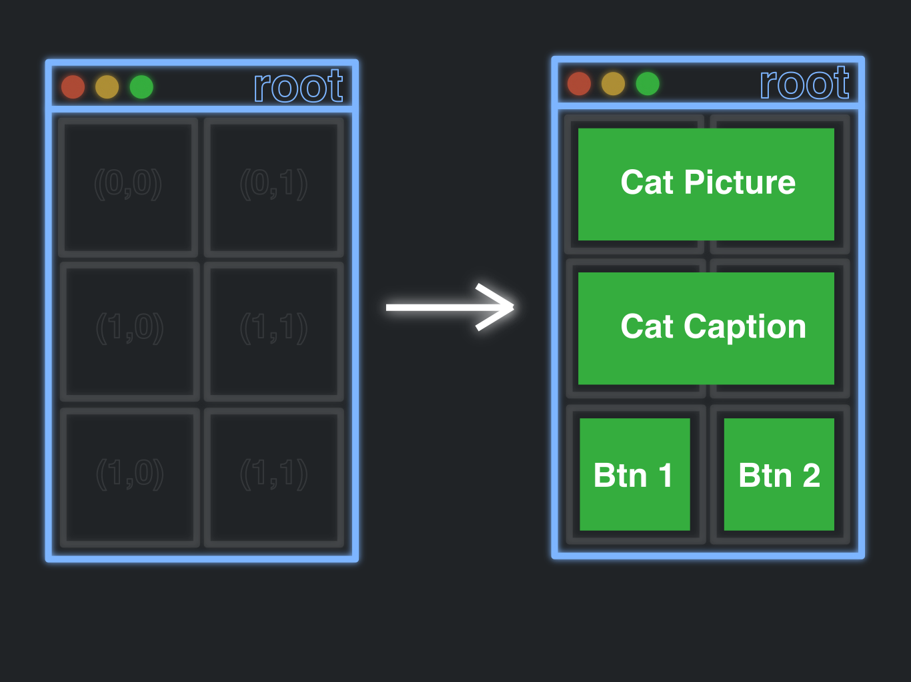

# Gui Widgets

In Tkinter, as has been said before, everything you are going to make your Gui out of is going to be a
widget . These all need to be initialized and then added to the root in some way.
We have already seen labels been initialized and added to the root, whether that be .pack()
or .grid(), but we will look at other widgets now.


# Images

First, lets display an image!

```python
import tkinter as tk


class ExampleProject(tk.Tk):

    def init_window(self):
        #self.geometry("500x500")
        self.title("EXAMPLE PROGRAM")
        self.resizable(width=True, height=True)
        self.configure(background="black")

    def __init__(self):
        super().__init__()
        self.init_window()
        self.cat_picture = tk.PhotoImage(file='Day1/assets/cat.png')  # DOING self. BEFORE THIS IS VERY IMPORTANT
        self.cat_picture = self.cat_picture.subsample(3,3)    # This will make the image smaller
        #self.cat_picture = self.cat_picture.zoom(3, 3)       # This will make the image bigger

        tk.Label(self, image=self.cat_picture).grid(row=0, column=0, sticky="NSEW")
        tk.Label(self, text="Here is a cat", font=("Helvetica", 20)).grid(row=1, column=0, sticky="NSEW")


def main():
    ExampleProject().mainloop()


if __name__ == "__main__":
    main()
```

Notice:
- We used a label component to display this image! We just had to tell it to use the "image" keyword parameter, which took
  an image object
- When we made the image object, first off, we can to call tk.PhotoImage(FILENAME) to actually get the picture.
  But secondly, we HAVE to do self.VARIABLE_NAME. This is because of the way tkinter interprets images. Essentially, if we did
  not include the self. it would mean that the cat_picture object is a temporary variable for the __init__ method. So, when
  the __init__ method is over, the cat_picture variable is non_existent and does not appear. So, we can just make it part of the Example_Project
  with self. and now it will stick around as long as our ExampleProject does (which, is as long as the window is open).
- The use of the subsample method will shrink the image, if you need it smaller than it original was. If you need to make the image bigger,
  use the zoom method. Either way, make sure you reassign the self.IMAGE_VARIABLE to the result of this zooming or subsampling.

## KEEP IN MIND THAT SUBSAMPLING DOES RUIN THE QUALITY OF THE IMAGE JUST A BIT

This example here is applying the subsample and then the zoom to restore it back to its original size. 
The way subsampling works is by removing pixel to fit into smaller space, so zooming in on a
subsampled picture is going to reveal these imperfections.

```python
import tkinter as tk


class ExampleProject(tk.Tk):

    def init_window(self):
        #self.geometry("500x500")
        self.title("EXAMPLE PROGRAM")
        self.resizable(width=True, height=True)
        self.configure(background="black")

    def __init__(self):
        super().__init__()
        self.init_window()
        self.cat_picture = tk.PhotoImage(file='Day1/assets/cat.png')  # DOING self. BEFORE THIS IS VERY IMPORTANT

        self.cat_picture = self.cat_picture.subsample(10, 10)
        self.cat_picture = self.cat_picture.zoom(10, 10)

        tk.Label(self, image=self.cat_picture).grid(row=0, column=0, sticky="NSEW")
        tk.Label(self, text="Here is a cat", font=("Helvetica", 20)).grid(row=1, column=0, sticky="NSEW")


def main():
    ExampleProject().mainloop()


if __name__ == "__main__":
    main()
```

Otherwise, it displays the image as you would expect!

----

# Buttons

Buttons are very similar to labels in that they can display images and text, but, they have the added functionality
of being pressed and activating some action.

For the sake of our example, lets add a button to our cat image code:

```python
import tkinter as tk


class ExampleProject(tk.Tk):

    def init_window(self):
        #self.geometry("500x500")
        self.title("EXAMPLE PROGRAM")
        self.resizable(width=True, height=True)
        self.configure(background="black")

    def __init__(self):
        super().__init__()
        self.init_window()
        self.cat_picture = tk.PhotoImage(file='Day1/assets/cat.png')  # DOING self. BEFORE THIS IS VERY IMPORTANT

        tk.Label(self, image=self.cat_picture).grid(row=0, column=0, columnspan=2, sticky="NSEW")
        tk.Label(self, text="Here is a cat", font=("Helvetica", 20)).grid(row=1, column=0, columnspan=2, sticky="NSEW")
        tk.Button(self, text="Ruin Quality").grid(row=2, column=0, sticky="NSEW")
        tk.Button(self, text="Restore Quality").grid(row=2, column=1, sticky="NSEW")


def main():
    ExampleProject().mainloop()


if __name__ == "__main__":
    main()

```


Few things to note:
- This section of code does add buttons, but the buttons do not do anything currently. They are just there. But, do notice
  that their creation and their addition to the grid is the same as it was for the label!
- Also, notice that ```columnspan=2``` was added to the picture and its caption. This is to make sure
  the picture and its caption are centered compared to the buttons. See the image below. It shows how the cat picture and captions
  are in the (0,0) and (0,1) spaces in the grid, except their span just consists of two columns, thus centering
  them in comparison to the buttons.



----

# Responding to Events

But, let's make these buttons actually do something!

```python
import tkinter as tk


class ExampleProject(tk.Tk):

    def init_window(self):
        #self.geometry("500x500")
        self.title("EXAMPLE PROGRAM")
        self.resizable(width=True, height=True)
        self.configure(background="black")


    def make_cat_quality_worse(self):
        self.cat_picture = self.cat_picture.subsample(10, 10)
        self.cat_picture = self.cat_picture.zoom(10, 10)
        tk.Label(self, image=self.cat_picture).grid(row=0, column=0, columnspan=2, sticky="NSEW")


    def make_cat_quality_original(self):
        self.cat_picture = tk.PhotoImage(file='Day1/assets/cat.png')
        tk.Label(self, image=self.cat_picture).grid(row=0, column=0, columnspan=2, sticky="NSEW")


    def __init__(self):
        super().__init__()
        self.init_window()

        # This method does exactly what we would do to initialize the image, so it is here as well
        self.make_cat_quality_original()

        tk.Label(self, text="Here is a cat", font=("Helvetica", 20)).grid(row=1, column=0, columnspan=2, sticky="NSEW")
        tk.Button(self, text="Ruin Quality", command=self.make_cat_quality_worse).grid(row=2, column=0, sticky="NSEW")
        tk.Button(self, text="Restore Quality", command=self.make_cat_quality_original).grid(row=2, column=1, sticky="NSEW")


def main():
    ExampleProject().mainloop()


if __name__ == "__main__":
    main()
```

- The first thing we did was add methods. The two methods here make the image quality of the picture worse and then re-add it to the grid.
  If we don't re-add it to the grid, the changes are never displayed.
- Once we have the methods in place, we just need to tell the buttons to call, aka **BIND**, those methods. We use the keyword parameter 
  `command=` to do this. Here we can see we are doing `command=self.make_cat_quality_worse` and `command=self.make_cat_quality_original`.
  When we do this, make sure you pass the function as a variable, as in, don't include the () as part of the function.
  This is also a place where an anonymous function could be utilized if you so pleased.

Here is an example of utilizing a lambda function in the command portion of a button:
```python
import tkinter as tk


class ExampleProject(tk.Tk):

    def init_window(self):
        #self.geometry("500x500")
        self.title("EXAMPLE PROGRAM")
        self.resizable(width=True, height=True)
        self.configure(background="black")

    def add_num_to_screen(self, add_val):
        self.num = add_val + self.num
        tk.Label(self, text=f"Num: {self.num}", font=("Helvetica", 20)).grid(row=1, column=0, columnspan=2,
                                                                             sticky="NSEW")

    def __init__(self):
        super().__init__()
        self.init_window()
        self.num = 0

        self.add_num_to_screen(0)
        tk.Button(self, text="Add one", command=lambda: self.add_num_to_screen(1)).grid(row=2, column=0, sticky="NSEW")
        tk.Button(self, text="Subtract one", command=lambda: self.add_num_to_screen(-1)).grid(row=2, column=1, sticky="NSEW")


def main():
    ExampleProject().mainloop()


if __name__ == "__main__":
    main()
```

This code simply adds one or subtracts one from a number and displays it. By using a lamda function, both
buttons can call the same method, but provide different input as to increment and or decrement the original number.

> **IMPORTANT NOTE:** every number is merely being placed on top of the previous number and not replacing it. We can see this if we remove `sticky="NSEW"` from the label and add/subtract a numer large enough to see the difference

------------------------------

## INSTANCE VARIABLES

These last two examples also help show us something called an **INSTANCE VARIABLE**. An instance variable
is data which is stored for and belonging to an object. In the cat picture example, to make sure the cat picture stayed around,
we make it an instance variable of our example project. This is exactly what we did for num in the last example as well. 
If we didn't do this in either case, the objects will become non-existent once the method it was initialized in was made, as was
mentioned for the cat image. 

### Point is, if you need data to stick around and you need to be able to change that for your GUI, make it an dinstance variable so it is tied to the program itself and will tick around and be accessible during the entirely of your programs existence.
 
----

# Text Fields
LOTS of times in your GUIs you will need to get text input from the user.
This is when a text field might come in handy!
Making one and getting its input is quite simple:

```python
import tkinter as tk


class ExampleProject(tk.Tk):

    def init_window(self):
        #self.geometry("500x500")
        self.title("EXAMPLE PROGRAM")
        self.resizable(width=True, height=True)
        self.configure(background="black")

    def add_text_message(self):
        tk.Label(self, text=f"This is what you typed: {self.input_obj.get()}").grid(row=3, column=0, padx=20, pady=20)

    def __init__(self):
        super().__init__()
        self.init_window()

        self.input_obj = tk.Entry(self)
        self.input_obj.grid(row=0, column=0, padx=20, pady=20)

        tk.Button(self, text="Submit", command=self.add_text_message).grid(row=1, column=0, padx=20, pady=20)


def main():
    ExampleProject().mainloop()


if __name__ == "__main__":
    main()
```


Note:
- use .get() on the input object to get the text in the field

## Type Conversion

Now just like input normally, it is returned as a string, so if you need to use it as an integer or float, you just
need to convert it properly. This may involve ensuring first it can be converted, but, we have done that before 
with input validation. In this case, it should just be a matter of changing the text to like, please enter a number actually.
See example below:

```python
import tkinter as tk


class ExampleProject(tk.Tk):

    def init_window(self):
        #self.geometry("500x500")
        self.title("EXAMPLE PROGRAM")
        self.resizable(width=True, height=True)
        self.configure(background="black")

    def add_text_message(self):
        message = ""
        try:
            message = f"Here is what you typed added by one: {int(self.input_obj.get()) + 1}"
        except ValueError:
            message = "Please enter an integer."
        for widget in self.grid_slaves(3, 0):
            widget.destroy()
        tk.Label(self, text=message).grid(row=3, column=0, padx=20, pady=20)

    def __init__(self):
        super().__init__()
        self.init_window()

        self.input_obj = tk.Entry(self)
        self.input_obj.grid(row=0, column=0, padx=20, pady=20)

        tk.Button(self, text="Submit", command=self.add_text_message).grid(row=1, column=0, padx=20, pady=20)


def main():
    ExampleProject().mainloop()


if __name__ == "__main__":
    main()
```

Also, notice that we are doing
```
        for widget in self.grid_slaves(3, 0):
            widget.destroy()
```
in the input validation method. 

What is happening if we don't do this is that we are just adding more and more values at grid point (3,0),
which, can look dumb. To fix this, we can remove all components there with this loop, which
goes through all components at this point and destroys them.
