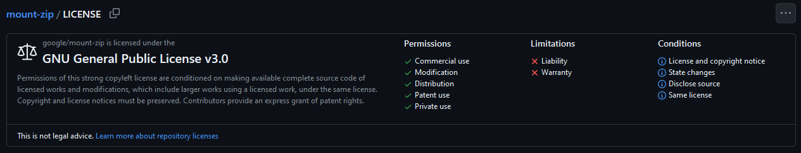
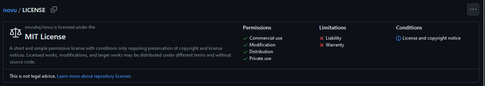
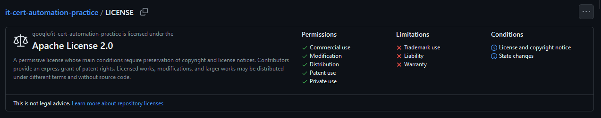
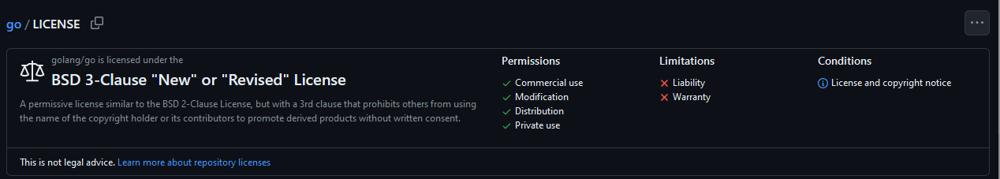

# Legal Issues:

-----

-----

## **Software Licensing**
- Proprietary licenses (commercial software) vs. open-source licenses (GPL, MIT, Apache).
  - **Proprietary Software** is code made for a specific company or individual
    - Outsiders are effectively restricted from accessing the code base
    - Examples:
      - Operating Systems like Microsoft Windows / macOS
      - Applications like Adobe Photoshop
      - Other software solutions like the Oracle Database System
  - **Open Source Software** is publicly accessible code and the code base can be viewed, modified, and redistributed 
    - This kind of project means that not only can any developer see (and hopefully gain trust in) the code of the software, but also can contribute to it
    - In a perfect scenario, this means that developers from the goodness of their hearts will all work together for the common goal of making safe, good, and trustworthy software. Honestly, this does end up how most open source project goes.
    - This is probably mostly due to the fact that you can be very easily judge in contributing to an opensource project. Lots of open source projects are found on GitHub, where one can view ever commit you have made. This means you ought to act as professional as possible when making code for open source projects. No making badly named variables, include lots of comments, and use the best coding practices. The code you are writing will be accessible and used by many people, so act like it.
    - Examples:
      - Game Engines: [Godot](https://github.com/godotengine/godot)
      - Operating systems: [Linux](https://github.com/torvalds/linux)
      - Software solutions: [Git](https://github.com/git/git)
      - Progamming Languages: [Python](https://github.com/python/cpython) and [Golang](https://github.com/golang/go)
  - **REGARDLESS HOW YOU WANT YOUR CODE ACCESSED, YOU NEED TO MAKE SURE THE KIND OF ACCESSIBILITY IS SET STRAIGHT TO AVOID LEGAL TROUBLES**
  - License (GitHub Page)
    - How to add license to your project (make LICENSE file in root directory)
    - https://choosealicense.com/ 
    - ### Types:
      - Proprietary Software
        - End User License Agreement (EULA): this is like the agreement you sign when making an account of using some sort of software
      - Open Source (these are screenshots pulled from repositories)
        - GNU General Public License
          - 
        - MIT License
          - 
        - Apache License
          - 
        - BSD Licenses (e.g. 3-Clause BSD)
          - 

-----

## Copyright and Patents
- Copyright
  - Copyright protects expression of ideas and works made, and for software development, this includes the code you write. 
  - You as the author of code gain exclusive rights to the code, and you don't need to even register it. Copyright is applied upon the creation of your work. Registering the work can add extra protections. 
  - Creating the work itself protects it from significant portions of the work from being copied or reproduced.
  - This applies to code and documentation written
- Patents
  - Patents protect inventions. In terms of software, this would novel, non-obvious methods, processes, or systems.
  - This grants the patent holder exclusive writes to make, use, and sell the invention.
  - This DOES require a formal application and approval from the patent office.
  - Software patents can get quite dicey, as a patent can represent abstract ideas which can sometimes be broad.
  - **Worlds Inc**
    - Worlds Inc has multiple patents that "describe various processes for organising and displaying multiple player avatars in shared 3D spaces"
    - They made a online mulitplayer game, world.com, in 1995. https://www.worlds.com/about-worlds. They then patented this idea. They really haven't expanded upon this since then. Their website literally is still advertising a bowie world from 1999... that and an investing page, which is very odd for a game development company????
    - Unfortunately, Worlds Inc has been abusing this patent to sue anyone who has a 3D multiplayer online game, this includes:
      - World of Warcraft, Call of Duty, lawsuit filed in 2012. https://www.pcgamesn.com/world-of-warcraft/worlds-inc-vs-activision-blizzard-patent-infringement-suit
      - Destiny added to Activision/Blizzard lawsuit in 2014 (Bungie is a subsidary of Activision) https://law.justia.com/cases/federal/appellate-courts/cafc/17-1481/17-1481-2018-09-07.html
      - Minecraft, lawsuit filed in 2020. https://www.nasdaq.com/press-release/worlds-inc.-vs.-microsoft-in-patent-infringement-lawsuit-related-to-minecraft-2020-09
      - Second Life, filed 2019 https://www.globenewswire.com/en/news-release/2021/05/17/2230729/0/en/Worlds-and-Linden-Lab-Conclude-Patent-Infringement-Lawsuit.html
  - Patents are supposed to protect ideas and allow the creator to benefit from their creation, hopefully to encourage the betterment of society and its capabilities, BUT we can see here how some people are abusing this protection for the sake of their own profits (common called Patent trolls)

-----

## Contractual Agreements

- As a developer you may enter into a contract for the sake of a company and/or product owner to deliver on a finished product.
  - You may face consequences for not doing this.
- You may also enter into contractual agreements to not share the software you develop for them
  - This is especially true for proprietary code, as it technically belongs to the company.
  - **Non-Compete Clauses (This isn't unique to software companies)**
    - You may even be prevented from working for a direct competitor of a company you currently work at for the knowledge you have of current company.

-----

## Software Liability

When making software (specifically software other people will use), you will be accountable for its success, or, more accurately, for when it fails.
This doesn't matter too much when making a list of numbers print out like we have done in this class, but
if those numbers were social security numbers and instead of your terminal they were a publicly viewable website, you would
have some problems.

When things like this happen, you may need some protection to protect you from liability. 
This is why you might want to use the Licenses showed before, as they lay out to the end user of
your software that you are not responsible for damages caused (unless there is **"deliberate and grossly negligent acts"**)

-----

## **Lawsuits and Other Legal Examples**
- Google
  - **ANTITRUST LAWS** 
    - Google faces legal struggle as it has monopoly over search engine
    - Biggest antitrust case since microsoft case
    - https://www.msn.com/en-us/news/technology/multibillion-dollar-apple-deal-looms-large-in-google-antitrust-trial/ar-AA1o5Bg9

- Meta AI Lawsuit
  - Issues about using created materials to train AI models without any sort of compensation for the OG creators
  - https://www.reuters.com/legal/litigation/judge-meta-case-weighs-key-question-ai-copyright-lawsuits-2025-05-01/