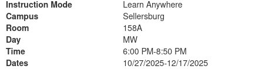

# SDEV 140 8-Week Plan

| W# | Monday Date | Wednesday Date | Module(s) / Topic(s)                                                                                                                                                                                                                             | Chapter(s) | Major Course Learning Objectives                                                                                                                                                                                                                                                                                                             | 
|----|-------------|----------------|--------------------------------------------------------------------------------------------------------------------------------------------------------------------------------------------------------------------------------------------------|------------|----------------------------------------------------------------------------------------------------------------------------------------------------------------------------------------------------------------------------------------------------------------------------------------------------------------------------------------------| 
| 1  | 3/17/25     | 3/19/25        | Talk about expectations for this class (especially coding wise)     Module 01 - Introduction to Python and Basic Elements of Programming    Software development methodologies, i.e. waterfall methodology.                        | 1 & 2      | Distinguish between systems software and application software.    Compare and utilize compilers, interpreters, and code generators.     Write, perform use-case testing, debug, and document programs in an integrated development environment.      Identify variables, constants, and data types used in programming. | 
| 2  | 3/24/25     | 3/26/25        | Module 02 - Loops and Selection Statements    Scope    Agile    Best Coding Practices (Comments, PEP, naming conventions,  etc)                                                                                             | 3          | Identify and use control structures.     https://ivylearn.ivytech.edu/courses/1258721/pages/introductory-standards-for-acceptable-software-development                                                                                                                                                                                | 
| 3  | 3/31/25     | 4/2/25         | Module 03 - Strings and Text Files    Talk about project    Show off TKinter (not full exploration)    Git talk, set up repo (README.md, gitignore)    markdown   Security                                    | 4          | Describe industry-standard software engineering tools.     Examine basic concepts related to secure programming.                                                                                                                                                                                                                      | 
| 4  | 4/7/25      | 4/9/25         | Module 04 - Lists and Dictionaries    Debugger     MIDTERM    Common python libraries           Software Tools (Package managers, PIP)                                                                               | 5          | Examine the use of software repositories and collaboration tools in software development.                                                                                                                                                                                                                                                    | 
| 5  | 4/14/25     | 4/16/25        | Module 05 - Design with Functions     OOP                                                                                                                                                                                                 | 6          | Explain abstraction, modularization, functions, and parameter passing in programming.                                                                                                                                                                                                                                                        | 
| 6  | 4/21/25     | 4/23/25        | Module 06 - Graphical User Interfaces     Error Handling     Design principles for GUI’s     Unit testing                                                                                                                   | 8          | Gain an understanding of the basic concepts of good user-interface design.                                                                                                                                                                                                                                                                   | 
| 7  | 4/28/25     | 4/30/25        | Module 07 - Design with Classes    OOP   Data structures and Design Patterns                                                                                                                                                       | 9          | Explain the fundamentals of object-oriented programming concepts.*     Develop competence in the techniques of systematic problem analysis, algorithm development, program construction, and documentation.                                                                                                                           | 
| 8  | 5/5/25      | 5/7/25         | Module 08 - Final Project (12/11/25) and Exam Due (12/13/25)    Talk about other programming languages    Maybe full lab day for people to work on project and ask questions about the final    Wendesday: SHOW OFF PROJECT | 10         | Discuss social, legal, and ethical issues in software engineering.      Apply the phases and design concepts of software development.                                                                                                                                                                                                 |  

CLASS ENDS May 13th Grades are Due

# Class Info

