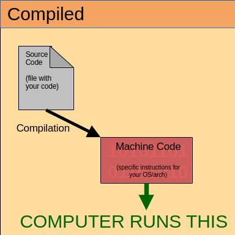
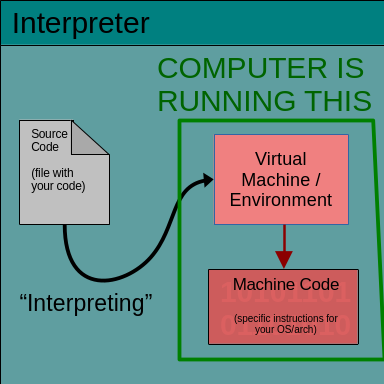

# Class Intro:

- Syllabus
  - Textbook
  - Make up policy
  - Grading
- Modules
- Resources
  - THESE Lecture notes
  - Markdown
  - Zoom Recordings
- "There will be a final project you are working in teams for, so think about it"


-----

# Python Intro

A lot of information presenting in these first few lectures is going be review!
Hopefully this gets everyone back into the groove of coding in python.

------

------

# Programming Languages and Python

Computers are simply machines... machines that we can instruct to do things.
Now, all the computer REALLY knows are bits, 0's and 1's.
Signals

I don't know if you know this, but you don't (only) see 0's and 1's when you use a computer

You see text, pictures, buttons and everything else. Even when working on a terminal, it is purely text based, not binary. Thus, we need some medium between how we work (with text, pictures, other things) to what the computer knows (binary). This is where programming languages and their code comes in!

In general, programming languages translates human readable text (code) into binary instructions (1s and 0s) that the computer can read.

------

## Types of languages:

When discussing programming languages generally, we need to make sure we understand the
specific difference between their types:

> high vs low level programming language

*and*

> compiled languages vs interpreted languages

### Low Level VS High Level Programming Language

A low level programming language, also called 'assembly' type programming languages, are ones
which more closely relate to the inner workings of the machine you are working on. You will
be directly placing things into registers on systems and managing memory directly. This
can provide developers the freedom to make the fastest code one could make, but the difficulty of 
these languages can often be a hurdle in its own right.

Example NASM (Assembly Languages) Printing Hello World:
```nasm
extern	printf

section .data 
msg:	db "Hello World", 0
fmt:    db "%s", 10, 0

section .text

global main
main:
  push    rbp 
  
  mov		rdi, fmt 
  mov		rsi, msg 
  mov		rax, 0
  call 	printf  
  
  pop		rbp     
  
  mov		rax,0	
  ret
```


A high level programming language are languages like C++, Java, Python. These
are far more human readable than low level languages, have built in memory managers and tools, 
and are FAR easier to learn. These are more accessible to most developers and, with 
a lot of the machine speak abstracted out, allow for developers to focus
on their code's function without worrying too much about fighting with the machine.

Example C++ (High Level Programming Language) Printing Hello World:
```cpp

#include <iostream>

int main() {
    std::cout << "Hello World" << std::endl;
    return 0;
}
```


Typically the resulting machine code created from these higher level programming languages
are more efficient than the code you would be writing in low level programming languages anyways, but
can also result in a lot of bloat!


### Compiled Languages (AOT aka ahead-of-time)



Compiled languages are kind of simply to understand. There
is the file which you edit, the source code, and there is
a compiler which reads that file and converts it to machine code, which the 
computer can understand. The compiler does a lot of stuff, like
making the code a bit more efficient, reducing unnecessary variables, 
making loops which don't need to be loops not loops, and more. Sometimes, some
languages will make the code into a secondary language which
it then will run through its compiler and then produce machine code.

For instance, for some C++ compilers, it will go from:

> C++ -> COMPILE -> Assembly -> COMPILE -> Machine Code


Examples:
- C & C++
- Golang
- Fortran
- Rust


### Interpreted Languages (JIT aka just-in-time)



Interpreted languages are TECHNICALLY allowed to run immediately, without 'compiling' first.

This is because they are INTERPRETED by some sort of secondary virtual program/environment/machine.

The interpreter will read your code and translate that to their predefined machine code, line by line.

Examples:
- *Python*
- Ruby
- PHP
- Javascript


### Comparing Interpreted Languages and Compiled Language

- Compiled code results in code which only works on the machine you are using, while interpreted languages should work on any machine which just has the require virtual environment.
- Compiled code has the initial cost of compiling the code, but the resulting code is typically faster than interpreted languages because everything is already in machine code, and doesn't NEED to be translated to machine code (line by line) like in interpreted languages.
- Compiler will inform you of many errors before running the code, unlike interpreted languages. Note: it is not uncommon for interpreted languages to have some syntax checking before being run.


------

------


# Python!!!!!!

- interpreted language (line by line)
- high level
- dynamically typed (no need to explicitly declare data types)
- TECHNICALLY object oriented
- open source
- widely used
- relatively easy syntax
- lots o good things for data science

# Install Python

- install from python's website [HERE](https://www.python.org/downloads/)
- alternatively, you can install it from a number of package managers, like [Chocolatey](https://community.chocolatey.org/packages/python), [Homebrew](https://docs.brew.sh/Homebrew-and-Python), and [whatever your preferred Linux package manager is](https://docs.python-guide.org/starting/install3/linux/)


# Making and Running a Python Program

So, with all that said and python installed, we can use it.

- make a file with the `.py` extension (so your computer knows it is a python file)
- add your code (something like `print('hello world')`)
- run the file:
  - if in an IDE, there should be a *RUN* button to run the file
  - if in the terminal, you can use `python <your-file-name>.py` to run it... you may need to use `python3` instead of `python`


-----

# Set Up of a python file and how it runs files

- line by line (interpreted language)
- indention
- no need for things like semi-colons (if you are familiar with other languages)


-----

# Python's Interactive Interpreter

- How to use:
  - Go to terminal -> type in `python` or `python3`
  - Alternatively, use Python IDLE's built in representation of the interactive interpreter shell

