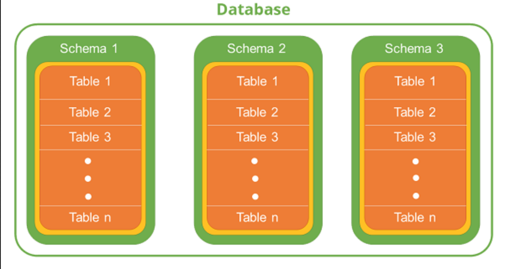

# Databases

Files are good storage, but, what if we need more data, and a fast way to access it

This is where databases come in.

## What are they: DBMS DataBase Management System

Database management systems are large scale data storage formats. They manage structuring, saving,
retrieving, and manipulating data for you. Many of times, these database
are independently running systems which is connected to like any other service.
Other times, it is a simple file. 

When comparing to simply saving information to a single file and calling it a day, databases
have many, MANY important benefits:

- allowing multiple users to access the data simultaneously
- have different levels of user, allowing some more privileges than others
- VERY quick, efficient methods to store and retrieve data.
- Data is explicitly defined to follow a certain set of rules (schemas and constraints)
- Easy to use methods to combine data
- A declarative query language: SQL (we will get to this later)

# Relational Tables

Relational tables are called such for two reasonsL

- they are tables; they have rows and columns, each column indicates a different type of value and every row defines 1 single instance of whatever the table represents
- is relational to other tables, as in there typically exists a connection to data within another table

In relational tables, there is typically one row that is referred to as the **PRIMARY KEY**.
This is a unique identifier for that row; it doesn't have to just be an ID of some sort.
The primary key can just be a combination of a few rows which creates a unique overall key.

Whatever the key is, it is **indexed** to allow a fast lookup; this is similar to hashing but NOT THE SAME!!
On whatever DBMS you use, the actual information in these tables is just stored on files; it is the system
around said file that really makes DBMS shine.

After having tables with primary keys, you can make your tables relational
by having other tables reference those primary keys. They are considered 'foreign keys'
in the other tables.


Here is a quick example:

### COMPANY Table

- ID acts as the primary key for company

| ID | Name             | Address                       |
|----|------------------|-------------------------------|
| 1  | Big Ads Company  | 123 Advertisement Way, LA, CA |
| 2  | Big Products LLC | 096 Make Money Avenue, LA, CA |


### EMPLOYEE Table

- ID acts as the primary key as well, and cmp_id is a foreign key to the company table.

- If an employee's cmp_id matches the one from the COMPANY table, it means they work for said company.

- Also note how, to ensure there is no null table entries, an employee is dependent on a company to exist first to populate it's cmp_id

- Also also note the usefulness of the ID, as despite there existing someone with the same name and dob as another employee, we can still distinguish between the users by a uniquely given id

| ID | CMP_ID | FIRST_NAME | LAST_NAME | DOB       |
|----|--------|------------|-----------|-----------|
| 1  | 1      | John       | Smith     | 1/1/1999  |
| 2  | 1      | John       | Smith     | 1/1/1999  |
| 3  | 2      | Bingus     | Smingus   | 2/11/1980 |
| 4  | 2      | Walter     | Halter    | 4/16/1987 |
| 5  | 1      | Cherish    | Clinton   | 9/12/1966 |


----

----

# SQL

For many, MANY database management systems, the fundamental way we
communicate to our database is through a language called **SQL**, i.e. **S**tructured **Q**uery **L**anguage

Unlike Python, Java and any other PROGRAMMING LANGUAGES (which are imperative),
SQL is a DECLARATIVE language. _Essentially, they are:_

> **_Imperative Language_**: A language where you explicitly define the steps to take to get the data you want (think of creating a loop to get the values in a list)

> **_Declarative Langauge_**: A langauge where you ask for a set of data, and it gathers it for you (essentially calling a function to gather the data you want without actually going through the list itself)

SQL is made this way as the underlying data structures of the DBMS is actually hidden from us as users of it. So, we simply need
a way to add/retrieve the data without us actually 'placing' the data.

SQL is different from the other programming languages since it is not 1 language.
Depending on the specific DBMS you are using, there may be some SQL statements
which are ever so slightly different compared to another DBMS. I will say, they are mostly the same,
but it is different enough where we refer each of these instances as an SQL Dialect.

Here are a few examples of these different DBMS:

### SQL Database Examples

- SQLite
- MySQL
- PostgreSQL
- Microsoft SQL Server
- Oracle DBMS

### NoSQL

- MongoDB

### Other

- Redis
  - Simple Key-Value Pair Database (think dictionary)

# General Structure



-----

-----

# Basics of SQLite

For the sake of this class, we are going to use SQLite
(for now), as it is incredibly easy to set up and start using, 
AND doesn't require a constant server be running.

## Install (and how it is just a file tee hee)

There are a few ways to install it:

- Their [website](https://www.sqlite.org/download.html)
- Through your package manager:
  - [Chocolatey](https://community.chocolatey.org/packages/SQLite)
  - [Homebrew](https://formulae.brew.sh/formula/sqlite)
  - Linux (plz look it up for your distro): ```sudo [ur package manage] install sqlite```

## Manage Database

When making a database, keep in mind that what we are actually
creating is just a file (which will store all of our tables within it)

### Create Database: 

> Through command ```sqlite3 database_name.db```


## CRUD (Create, Read, Update, and Delete)


------

------

# ORM

## SQLite3

## SQLAlchemy


