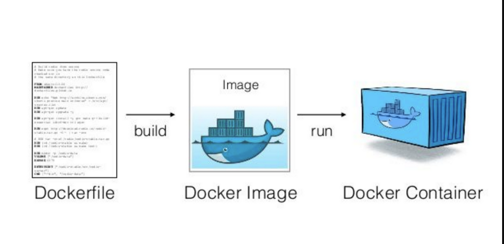

# Containers and Virtual Machines

So, what is a container???? Also, while we are here, what is a virtual machine???

The first thing we need to understand is what is a normal machine.

The computer and operating system you are working on is your physical machine.

When making code, there are many things that it depends on:

- being compatible, compilable, and working with your operating system
- having enough resources to actually operate (like memory and space)
- having the programming language needed to be installed, along with other tools and packages for said programming language

Some of these things are annoying to get around, but if
you are trying to work on a project with others, it can
be difficult to ensure code on your computer works on theirs. 

To make sure you are all using the same environment for the project, you would have to ensure you all are using all
the same things previously mentioned, which is kinda ridiculous to ask for of most people.

There are two MAIN ways to accomplish this: virtual machines and containers

## Virtual Machines (VM)

Virtual machines are programs which VIRTUALIZE an entire machines, meaning
the underlying hardware along with an operating system, which requires a lot
of space. They rely on a hypervisor to allocate the host's machines resources to act 
in space for the virtual machine.

This creates an all encompassing machine all running on your device. This is great
when messing with viruses, for instance, as the fake machine can get infected, and 
you can see the results without risking your own device. WORD OF WARNING: some viruses 
knows you are using a virtual machine and actually break out of it on to your host OS, so, plz
be careful.

## Containers

Containers are different in that they only virtualize the operating system itself (sometimes this is only 
a portion of an operating system as well). Fundamentally, containers run on top
of your systems kernel and make api calls to virtualize the desired OS. [See this page for a nice looking
comparison.](https://learn.microsoft.com/en-us/virtualization/windowscontainers/about/containers-vs-vm)

This results in much smaller sizes of virtual environments. These virtualized operating systems run on some type
of docking engine, where it allocates your systems memory and space for the container, and then runs it.

Because of this, containers are typically able to be run a lot quicker, as it does not need the time to 
create a whole device virtually, just the software side of it. This does mean that docker containers are 
typically less secure as they share memory with your device.

We are going to utilize a container system called Docker in this class to help grasp a simple understanding.

# [Docker](https://www.docker.com/)

Docker is a free software to run containers on. The underlying docker engine is open source, but
what we are going to want to use, Docker Desktop, is proprietary software. If you were
using this in a commercial setting, you would need to pay for it, but since this
is under the domain of "personal development", we can utilize it for free.

Docker is a perfect tool for creating environments to run on any device you need.
It gives us a platform to control what we are running, along with tools to
create configured machines EASILY.

## Installation

You are going to want to install Docker from their website:

See it here: https://www.docker.com/get-started/

If you are on windows, it may bring up an error immediately when truing to run Docker Desktop.
If this occurs, there are a few commands and steps you need to take:
- https://learn.microsoft.com/en-us/windows/wsl/install
- https://learn.microsoft.com/en-us/windows/wsl/install-manual

# Parts of python

Now, when working with Docker, there are a few things that need to be understood

## Dockerfiles

Dockerfiles are instructions for how to construct an image of a container.
These define what versions of operating systems we want, along
with configurations needed to start your application 

## Images

Images are machines which are all configured and ready to be deployed for whatever
you need. This is what would be shared between developers in 
an effort to run the same container. The same image can be run
on other machines, and you end up with the same container.

Images can also be downloaded online if there is already one set up you want.

Regardless of the case, images are ran and become docker containers.

## Containers 

Containers are actually machines which are running and you can interact with them. The image is simply their starting
point.

Containers should have the applications we want on them.

Here is a chart explaining this whole process:



## Basic Commands

To build a image from a docker file:
```docker build -t <desired_image_name>```

To pull a pre-created image
```docker pull <iamge_name>```

To run a image:
```docker run <image_namew>```

To stop running container:
```docker stop <container_id>```

To start a previously stopped container:
```docker start <container_id>```

See the currently running containers
```docker ps```

See current docker images:
```docker images```

Remove docker container:
```docker rm <container_id>```

Remove docker image:
```docker rmi <image_name>```

### Walk through Docker Desktop 

### Install and run Ubuntu container

We can quickly get started with a container by pulling the official docker Ubuntu image. This
does not require any dockerfile

On the command line, run:
```
docker pull docker
```

Once the docker image is installed, we can run it using this command:
```
docker run -itd ubuntu
```

We can now see the container from Docker Desktop.
From there, we have access to lots of things; 
one of the most important things is to utilize the container's
command line interface. This allows us to directly 
change this specific instance of an image (container).

We can also get database systems as well.
But why would we want to do this? Well, instead of running a database
system on our device and allowing to create files on our computer, we can
limit it into a container and keep it all... contained.

This also allows us to replicate the database on other computers, even
if postgres is not compatible with that device, as is will be compatible as 
a container just fine.

[Here is the container for postgres!](https://hub.docker.com/_/postgres/)

## Running Application

If we want to actually containerize our application, we can use a dockerfile!

- See ./example_docker_project/Dockerfile as example.
  - Here is initial image for [python](https://hub.docker.com/_/python/)!


Build this dockerfile into an image with this command:
```
docker build -t simple_app .
```

To then run this image, we want to run the following command.
In the following command, we are port forwarding the 8080 command
to have access to it outside the container. Specifically, the 7000 refers
the port on your local device, while the 8080 is the port on the container.
So, we are forwarding the port from the container to one on our device:
```
docker run -itd -p 7000:8080 simple_app
```

The flag -itd makes the process run in detached mode (won't open a terminal for machine in command)

The flag -p is setting the port!

Now we can go to http://localhost:7000 and see this!


Now, anyone else wanting to work on our app will not 
need to install everything on their local device, but
just keep everything on the container.