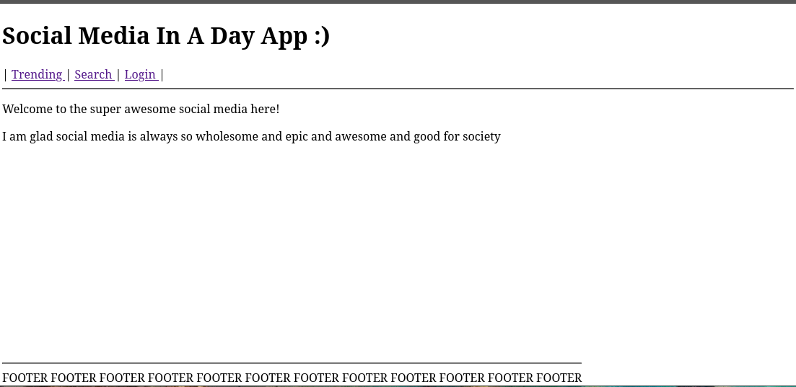

# INTRO to Making EPIC Reusable Assets in your SUPER COOL djnango project.

Right now, your project probably looks like this right:



There are few problems with this website:
- Looks ugly and bad
- STINKY
- DUMB
- There is no way to display dynamic data!!!!

For instance, the point of this website is SUPPOSED to display posts
made by users.

Currently, this is merely a static page without the ability to insert this data into the
page even if it wanted to.

So today, we will learn how to
- add dynamic data to your webpage
- make assets and components which can be re-used in plenty of places
- make it look pretty!

----------

# Dynamic Data:

So, before we can even begin start adding dynamic data, we need to first have some data to dynamically
put on our page.

For our example, lets say we are trying to display the top posts of
the day on our front page of the website.

To give us something to work with, a file
in day_social/inserts.py has been added
to insert a bunch of data into our website (lots of topics and lots of posts).

## Getting the data to our HTML Templates

First thing we need to do is get the data;
here, we are using the same Django ORM querying we talked about last week.

We are going to want to do this within the views.py file, as if some error occurs
in searching for data, we can perhaps change the view the user sees (like, "hey, you encountered an error loading this page" or something).


With the data gathered, we can pass this to the template. This is what the point of the 
{} inside of the call to the template is for.

This is where we place key value pairs to display on our page!
Here is a test page, passing a single post to the template!

```python
def simple_show_template_tag_page(request):
    first_post = Post.objects.first()
    return render(request, 'simple_tag.html', {'post':first_post})
```

With this passed, we can now access the values from within our template!!!!

To use it within our program, we simply place it inside of a {{ TAG_NAME }}

Here is the simple_tag.html file with an example of using the last tag!


```html
<!DOCTYPE html>
<html lang="en">
    <head>
        <title>Test Tag</title>
    </head>
    <body>
        Here is the first post: <br>
        {{ post }}
    </body>
</html>
```

This will pull the definition of the string (in the model's __str__ method) that we defined for the object when it places it within the html.

With this, we TECHNICALLY have dynamic data. The data in the database can change, and this page WILL change with it. 

Currently, we have two MAIN problems:
- Looks lame and bad
- This is just a single item, and typically we want to display MORE!

So, let's learn how to do that

# More Data!

Now, for the main page, we are going to want more than a single post.
So, we are going to get all the posts with the .all() method, along with then
ordering them in descending order by epic value (so most EPIC value appears at the top),
and then only getting the first 35 values.

``` python
def main_page(request):
    # Here, we are getting all posts and ordering them all by the epic value (and the highest epic value as the first value)
    # The [:10] at the end ensures we get only the top 35 posts of all posts
    posts = Post.objects.all().order_by('-epic_value')[:35]

    return render(request, 'main_page.html', {'posts':posts})
```


With these values obtained in a query-set, we can then pass them to template just like we did before!

We can then use it within our main page just like we did before:

```html
        <div>
            {{ posts }}
        </div>
```

When this is rendered to the screen, it tries to convert it immediately to a string, which makes it appear
bad and unorganized.

We can begin to fix this with a loop that django interprets within the html:

```html
        <div>
            
                {{ post }}
            
        </div>
```

In this SIMPLE example, we can see
- the beginning of creating 'variables' within the html itself
- loop
- thats really it

Inside of this loop, we can make as much html as we want, which means this loop essentially becomes a factory
for creating assets.

Currently, this output it is creating looks BAD, but with some 
additional html (and accessing different parts of our
variable we got from the loop), we can
make this look every so slightly better looking!

```html
    <div>
        
            <div>
                <hr>
                <h2>  / {{ post.epic_value }} / &ensp; &ensp; (THIS IS EPIC) </h2>
                <h4> <a href="topics/{{post.topic}}"> {{ post.topic }} </a> / <a> {{ post.author }}  </a></h4>
                <p> {{ post.text }} </p>
            </div>
        
    </div> 
```

Notice a few things here:
- we can access the individual values within our objects which we passed in, so passing useful objects to our html is kinda important!
- we can even use the values within things like html attributes, so we can make dynamic links like for our topics here (currently they have no where to go :( THIS IS SAD AND WILL BE SOLVED LATER  )


# WOOOOOO

Now we have all the data from our backend... IN OUR FRONT END!
So, we need to now learn how to make it actually pretty looking.

We can use this with CSS (and technically bootstrap)