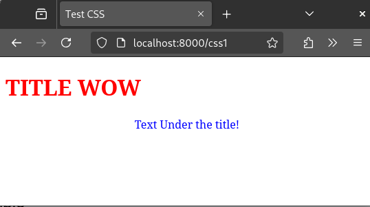
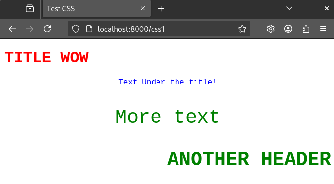

# CSS (Cascading Style Sheets)

This is a language used to describe the way elements on your
website should look and be formatted.

Soooo, how do we use it.

# Inline CSS

TECHNICALLY, the EASIEST way to begin is by simply adding a 'style' attribute to an existing html tag.
For instance, like this:

```html
<!DOCTYPE html>
<html lang="en">
<head>
    <title>Test CSS</title>
</head>
    <body>
        <h1 style="color: red;">TITLE WOW</h1>
        <p style="color: blue; text-align: center;">
            Text Under the title!
        </p>
    </body>
</html>
```



Here we can see a very simple example, just changing a color of the text with the color option,
and an example with more than one styling, with color and text-align. Notice how in this format,
we separate each style with a semi-colon (;).


Also, notice in this next example how that if a tag with a given has inner tag, that
style will be applied to the inner tags as well (as long as they don't override the same tag).

This allows us to quickly change the whole look of a website.

-----

This works, BUT, is a bad set up. For instance, if we want all the text on a page for paragraphs to be
formatted a certain way, we may have to add that same attribute to every '<p>' tag, which would be annoying. ALSO,
if you wanted to go back and change the look of it, you would then have to go searching through
your HTML, looking for the things you want to change. 

To solve this, we mayhap want to store it all in the same place!

# INTERNAL CSS

So, an EASY way to add css is to just add it straight to your html document.

If we wanted to convert our last page to utilizing CSS, we would
make a new tag within our head tag called style, where we can start making 
css 'objects'.

CSS 'objects' take on this format:
```
TAG_NAME {
    style_key: value;
    style_key: value;
    ...
}
```
Essentially, this replaces adding styles to just individual tags, and will now apply the given style to every tag
in the file. Also, it gives us a cleaner look than an attribute within HTML!

So, the same file, set up to use css proper looks like this:

```html
<!DOCTYPE html>
<html lang="en">
<head>
    <title>Test CSS</title>
    <style>
        body {
            font-family: 'Courier New', Courier, monospace;
        }

        h1 {
            color: red;
        }

        p {
            color: blue;
            text-align: center;
        }

    </style>
</head>
    <body>
        <h1>TITLE WOW</h1>
        <p>
            Text Under the title!
        </p>
    </body>
</html>
```

This page look EXACTLY the same as before, but now the HTML itself appears a lot more simpler.
Also, any additional headers or paragraphs will now automatically have the same style applied to it.

# Custom Tags

Now, sometimes, we want to do some special things, such as:
- Have 1 Instance of a html element (like 1 paragraph) to display differently than the rest (overriding a few things)
- Have different html elements (like a 'p' and a 'h1') appear the same in some fashion, without effecting overall formatting
- Not be restricted to only formatting by html tags

To solve these problems, we can use CUSTOM TAGS.
That is, custom names we can apply to tags (using the CLASS attribute) to apply our css specifically to them.

To make a custom tag, we simply make a normal css entry, but put a DOT before it, for instance, like this:
```css
.my_object{
    color:blue;
}
```

NOW, sometimes, we want to make custom tags that are specifically applied to specific html elements, for instance, only
applying it to the header of the page. SO, to write css for an instance like this, you simply put the html element tag
name before the DOT and your custom name, and you are good!

It would look something like this:

```
TAG.MYNAME {
    attribute: value;
    ....
}
```

Using all of this, we can add some specific elements to our test page:

```html
<!DOCTYPE html>
<html lang="en">
<head>
    <title>Test CSS</title>
    <style>
        body {
            font-family: 'Courier New', Courier, monospace;
        }

        h1 {
            color: red;
        }

        p {
            color: blue;
            text-align: center;
        }

        .my_thing {
            color: green;
            font-size: 40px;
        }

        h1.my_thing {
            text-align: right;
        }

    </style>
</head>
    <body>
        <h1>TITLE WOW</h1>
        <p>
            Text Under the title!
        </p>
        <p class="my_thing">
            More text
        </p>
        <h1 class="my_thing">
            ANOTHER HEADER
        </h1>
    </body>
</html>
```



Do notice a few things:
- the paragraph with the custom tag is still have the same formats previously applied (being centered), but has the new size one along with the OVERWRITTEN color on.
- the header has everything the .my_thing tag has defined along with the addition of what is defined in its specific tag reference

Along with classes, there are additional custom tags called ids. Instead
of initializing them with a DOT, we instead use a HASHTAG.

ID's will will override classes and are used for more one-off things. If there is a reused tool, we probably want to use a class, like for highlighted text in many place, but if we are describing a specific asset or place.

These instead look like this:

```css
#my_id {
    color:red;
}
```

And are used in the ID attribute and NOT the class one:

```html
<p id="my_id">
  Here is my text  
</p>
```


# EXTERNAL CSS

Now, defining the CSS within the html file is 'fine', but what is standard and allows for more concise and a sharable 
format is to create a file specifically for the styling.

This allows you to not only have styling in a separate file for simplicity sake, but also 
use the same styling for all the pages on your website, to make the whole
system far more easier to manage and add to.

So, how do we create this file and connect it to our html?
(example in css_2).


### Create File

Creating a file for css is very simple. It is simply a file (duh) with the .css extension
on it.
Inside the file, it works exactly the same as we saw it within the style section before. 
tag names with {} containing the different styling for them.

See example.css for an example!

### Add to Page

To actually have our html have access and use this stylesheet, we simply need
to direct it there.

Within the head of our html file, we are going to want to add a <link> tag.
This is going to reference our file as the stylesheet for our html file.

It should look something like this:
```html
<link rel="stylesheet" href="my_css_file.css">
```

Typically, when doing this, we only need to direct our html page to the css stylesheet in 
reference to itself. For instance, if the css file was in the same directory as the 
html file, we could something very similar to what we are doing over, where we simply put
the css files name itself. If it was in a directory above, maybe we would utilize ../file.css.

Our problem right now is that we cannot simply do this in Django, as it is rendering these pages in a specific way,
So, we are going to want to follow its format in doing this.

### Make static folder and put css in it

What we are going to do is make a folder called static in the root of our project and put our css in there.
For the sake of our example and to keep it organized, I am placing it within a subdirectory called css, but this is not
necessary.

Also keep in mind, this static folder is where many more static things for our website will be found and used, such as images. 
This is why it is important to keep it organized. It is essentially our asset folder for our project.

### Tell our django project where static folder is!

We then want to actually tell our django project where this asset folder can be found.

Within the MAIN directory of our site, in the settings.py folder, we are going to want to add this piece of code:

```python
STATICFILES_DIRS = [
    BASE_DIR / "static"
]
```

If you are placing the static folder in a different directory, then this is where you would specify that!

### Tell our HTML the path!

Now within our html file, we can tell it to find the css in relative position from the static folder, like this:

```html
<link rel="stylesheet" href="static/css/example.css">
```

We can FINALLY see this be applied to the website with the html found within css_2/simple_css.html

With this all set up, we can EASILY now use the same css for any html file we have without worrying about trying to redirect
it from a new relative position.

# How do I know what tags to change, and to change them to what

LOOK IT UP (this is literally something you will have to learn over time
from LOTS OF LOOKING UP, 'taking inspiration' from other's CSS, and what not. This
is really the same thing for most coding, but whatever).

But, we can look at a few of em.

